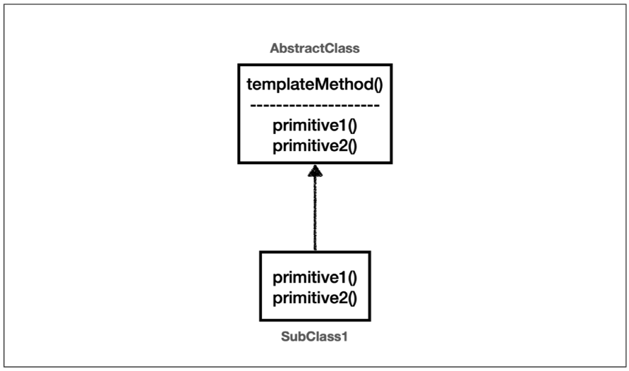
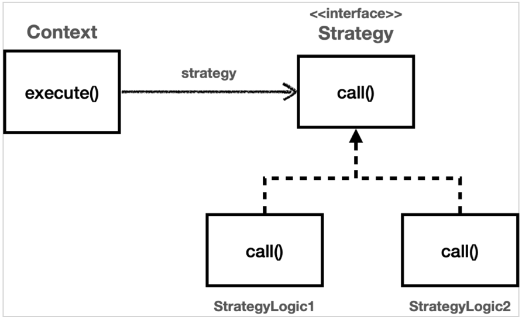

### ThreadLocal
- 해당 쓰레드만 접근할 수 있는 저장소 (`java.lang.ThreadLocal`)
- 테스트 : `ThreadLocalService.java`, `ThreadLocalServiceTest.java`
- `ThreadLocal<T>`를 사용한다.
- **주의사항** : 사용 후 `remove()`를 통해 제거하지 않았을 경우, 새로운 요청이 기존 요청의 ThreadLocal 값을 읽는 위험한 일이 발생할 수 있다.

### 템플릿 메서드 패턴
- 
- 다형성을 활용하여 **변하는 것**과 **변하지 않는 것**을 분리한다.
- 부모 클래스(Abstract Class)에 변하지 않는 템플릿을 두고, 변하는 부분(Abstract Method)을 자식 클래스에서 구현한다. 
- 테스트 : `TemplateMethodTest.java`
- 상속을 사용하기 때문에 클래스간 강하게 결합된다. (심지어 부모의 기능을 사용하지 않더라도)
- 어쨌든 원본 코드를 수정하긴 해야함

### 전략 패턴
- 
- 변하지 않는 부분을 `Context`에 두고, 변하는 부분을 `Strategy` 인터페이스로 구현하여 문제를 해결
- 상속이 아닌 위임
- 테스트 : `ContextV1Test.java`
- 파라미터로 `Strategy`를 건내면 유연한 의존성 주입이 가능하다.
- 어쨌든 원본 코드를 수정하긴 해야함

### 템플릿 콜백 패턴
- 다른 코드의 인수로서 넘겨주는 실행 가능한 코드를 콜백이라고 함
- 템플릿 코드가 존재하고, 템플릿에서 사용 할 콜백 메서드를 파라미터로 주입해 주는 패턴
- 위에서 개발한 전략 패턴과 유사
- 테스트 : `TemplateCallbackTest.java`
- 어쨌든 원본 코드를 수정하긴 해야함

### 프록시 패턴
- 프록시 객체로 변경해도 클라이언트 코드에 수정이 없어야 한다.
- 클라이언트는 서버에게 요청 한 것인지, 프록시에 요청한 것인지 몰라야 한다.
- 프록시의 주요 기능
  - 접근 제어 (프록시 패턴)
    - 권한에 따른 접근 차단
    - 캐싱
    - 지연 로딩
  - 부가 기능 추가 (데코레이터 패턴)
    - 원래 서버가 제공하는 기능에 더해서 부가 기능을 수행
- 테스트 : `ProxyPatternTest.java`, `CacheProxy.java`
- **인터페이스 프록시** : 변경할 가능성이 있다면 유리하지만, 인터페이스를 매번 만들기 번거롭다.
- **클래스 프록시** : 상속을 사용하기 때문에 제약이 많다.
- 어찌되었건, 위 두 방법은 모두 공통 관심사 로직을 위한 클래스나 인터페이스를 매번 만들어줘야 하는 불편함이 있다.

### 데코레이터 패턴
- 프록시 패턴과 비슷하지만, 주로 부가 기능 추가에 사용 됨
- 테스트 : `DecoratorPatternTest.java`
