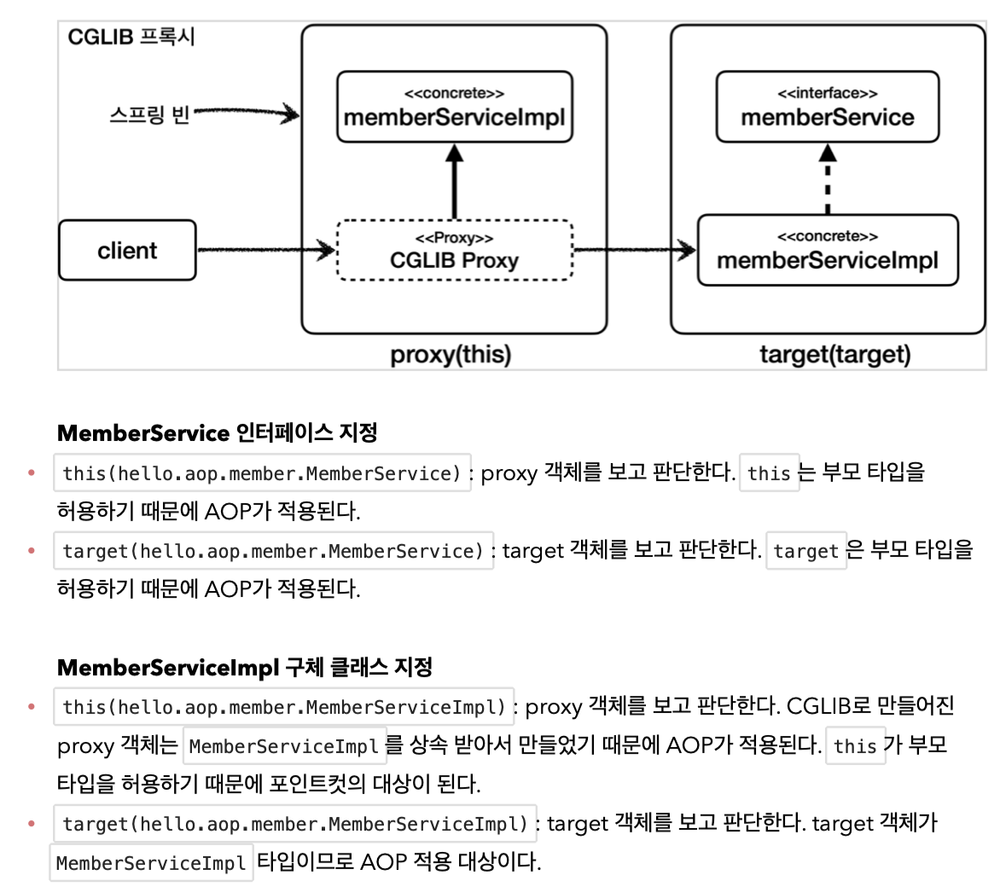

### ThreadLocal
- 해당 쓰레드만 접근할 수 있는 저장소 (`java.lang.ThreadLocal`)
- 테스트 : `ThreadLocalService.java`, `ThreadLocalServiceTest.java`
- `ThreadLocal<T>`를 사용한다.
- **주의사항** : 사용 후 `remove()`를 통해 제거하지 않았을 경우, 새로운 요청이 기존 요청의 ThreadLocal 값을 읽는 위험한 일이 발생할 수 있다.

### 템플릿 메서드 패턴
- 
- 다형성을 활용하여 **변하는 것**과 **변하지 않는 것**을 분리한다.
- 부모 클래스(Abstract Class)에 변하지 않는 템플릿을 두고, 변하는 부분(Abstract Method)을 자식 클래스에서 구현한다. 
- 테스트 : `TemplateMethodTest.java`
- 상속을 사용하기 때문에 클래스간 강하게 결합된다. (심지어 부모의 기능을 사용하지 않더라도)
- 어쨌든 원본 코드를 수정하긴 해야함

### 전략 패턴
- 
- 변하지 않는 부분을 `Context`에 두고, 변하는 부분을 `Strategy` 인터페이스로 구현하여 문제를 해결
- 상속이 아닌 위임
- 테스트 : `ContextV1Test.java`
- 파라미터로 `Strategy`를 건내면 유연한 의존성 주입이 가능하다.
- 어쨌든 원본 코드를 수정하긴 해야함

### 템플릿 콜백 패턴
- 다른 코드의 인수로서 넘겨주는 실행 가능한 코드를 콜백이라고 함
- 템플릿 코드가 존재하고, 템플릿에서 사용 할 콜백 메서드를 파라미터로 주입해 주는 패턴
- 위에서 개발한 전략 패턴과 유사
- 테스트 : `TemplateCallbackTest.java`
- 어쨌든 원본 코드를 수정하긴 해야함

### 프록시 패턴
- 프록시 객체로 변경해도 클라이언트 코드에 수정이 없어야 한다.
- 클라이언트는 서버에게 요청 한 것인지, 프록시에 요청한 것인지 몰라야 한다.
- 프록시의 주요 기능
  - 접근 제어 (프록시 패턴)
    - 권한에 따른 접근 차단
    - 캐싱
    - 지연 로딩
  - 부가 기능 추가 (데코레이터 패턴)
    - 원래 서버가 제공하는 기능에 더해서 부가 기능을 수행
- 테스트 : `ProxyPatternTest.java`, `CacheProxy.java`
- **인터페이스 프록시** : 변경할 가능성이 있다면 유리하지만, 인터페이스를 매번 만들기 번거롭다.
- **클래스 프록시** : 상속을 사용하기 때문에 제약이 많다.
- 어찌되었건, 위 두 방법은 모두 공통 관심사 로직을 위한 클래스나 인터페이스를 매번 만들어줘야 하는 불편함이 있다.

### 데코레이터 패턴
- 프록시 패턴과 비슷하지만, 주로 부가 기능 추가에 사용 됨
- 테스트 : `DecoratorPatternTest.java`

### 동적 프록시
#### 리플렉션
- 리플렉션 테스트 : `ReflectionTest.java`
- 리플렉션은 클래스나 메서드의 메타정보를 사용해서 동적으로 호출하는 메서드를 변경할 수 있다.
- 하지만 리플렉션은 런타임에 동작하기 때문에 컴파일 시점에 오류를 잡을 수 없다. (위험하다)

#### JDK 동적 프록시
- 테스트 : `JdkDynamicProxyTest.java`
- 동적 프록시를 통해 개발자가 직접 프록시 클래스를 만들지 않아도 된다.
- JDK 동적 프록시는 **인터페이스를 기반**으로 프록시를 동적으로 만들어준다.
- JDK 동적 프록시에 적용할 로직은 `InvocationHandler` 인터페이스를 구현해서 작성하면 된다.
  - 파라미터
    - `proxy` : 프록시 자신
    - `method` 호출한 메서드
    - `args` : 메서드를 호출할 때 전달한 인수
- `Proxy`는 `InvocationHandler` 구현 클래스의 로직을 실행한다.
  - 인터페이스에 대한 메소드 요청이 들어오면, Proxy가 그걸 받고, `InvocationHandler`의 `invoke`를 실행하고, 내부에 메서드의 수행이 있으면 수행한다.
- 
- 한계
  - 인터페이스 대신 클래스만 사용하는 경우 -> `CGLOB`이라는 바이트코드 조작 라이브러리를 사용해야 한다.
#### `CGLIB`
  - 바이트코드를 조작해서 동적으로 클래스를 생성하는 기술을 제공한다.
  - **구체 클래스만으로** 동적 프록시를 만들 수 있다.
  - 스프링의 내부 소스 코드에 포함되어있다.(라이브러리를 추가하지 않아도 된다.)
  - JDK 동적 프록시의 `InvocationHandler`처럼, `CGLIB`은 `MethodInterceptor`를 제공한다.
  - 테스트 : `CglibTest.java`
  - `Enhancer`를 통해 프록시를 생성한다.
  - 프록시를 만들 때 상속 구조이다. (`final` 키워드에 민감하다.)
  - 클래스에 대한 메소드 요청이 들어오면, 클래스를 상속받은 Proxy가 그걸 받고, `MethodInterceptor`의 `intercept()`를 실행하고, 내부에 메서드의 수행이 있으면 수행한다.
  - 

### 스프링이 지원하는 프록시
#### ProxyFactory
  - 스프링은 `ProxyFactory`를 제공하는데, 인터페이스가 있으면 JDK 동적 프록시를, 구체 클래스만 있으면 CGLIB을 사용한다.
  - 두 기술(`InvocationHandler`, `MethodInterceptor`)을 함께 사용하려면 `Advice`를 만들기만 하면 된다.
    - `Advice`는 `org.aopalliance.intercept`를 구현하면 된다.
    - 테스트 : `ProxyFactoryTest.java`
  - 
#### PointCut, Advice, Advisor
- `PointCut` : 어디에 부가기능을 적용할지, 적용하지 않을지 판단하는 필터링 로직
  - `NameMatchMethodPointcut` : 메서드 이름을 기반으로 매칭(`PatternMatchUtils` 사용)
  - `JdkRegexpMethodPointcut` : JDK 정규 표현식을 기반으로 포인트컷을 매칭
  - `TruePointcut` : 항상 참을 반환
  - `AnnotationMatchingPointcut` : 애노테이션으로 매칭
  - `AspectJExpressionPointcut` : aspectJ 표현식으로 매칭(가장 많이 사용)
- `Advice` : 프록시가 호출하는 부가 기능
- `Advisor` : `PointCut` + `Advice`
- 
- 테스트 : `AdvisorTest.java`
- 스프링은 AOP를 사용할 때 최적화를 진행해서 프록시는 하나만 만들고, 하나의 프록시에 여러 어드바이저를 적용한다. (target마다 하나의 프록시만 생성한다.)
- `ProxyFactory`를 통해 인터페이스와 클래스에 관계없이 편하게 프록시를 설정하고, `Advisor`덕에 어디에 어떤 기능을 적용할지 명확해 졌다. 
- 하지만 설정파일이 지나치게 많아지고, V3처럼 컴포넌트 스캔의 경우 프록시 적용이 불가능하다는 단점이 있다. -> **빈 후처리기** 등장

### 빈 후처리기(BeanPostProcessor)
- 빈에 등록할 객체를 빈 저장소에 등록하기 직전에 조작하는 기능을 제공
- 
- 빈 후처리기에서 빈을 바꿔치는 것도 가능
- `BeanPostProcessor` 인터페이스를 구현하고 빈으로 등록
  - `postProcessBeforeInitialization()` : 객체 생성 이후 `@PostConstruct`와 같은 초기화가 발생하기 전에 호출
  - `postProcessAfterInitialization()` : 객체 생성 이후 `@PostConstruct`와 같은 초기화가 발생한 다음에 호출
- 기본 빈 등록 테스트 : `BasicTest.java`
- BeanPostProcessor 테스트 : `BeanPostProcessorTest.java`
- 빈 후처리기를 통해 빈 객체를 프록시 객체로 교체할 수 있다.
- `@PostConstruct` 자체도 `CommonAnnotationBeanPostProcessor`라는 자동으로 등록되는 빈 후처리기를 활용
- 스프링이 기본 제공하는 빈 중에서는 프록시 객체를 만들 수 없는 빈들도 있기 때문에, 모든 객체를 프록시로 만들 경우 오류가 발생한다.
#### 스프링이 제공하는 빈 후처리기
- 스프링 부트 자동 설정으로 `AnnotationAwareAspectJAutoProxyCreator` 빈 후처리기가 빈에 자동 등록된다.
  - 스프링 빈으로 등록된 `Advisor`들을 자동으로 찾아서 프록시가 필요한 곳에 자동으로 프록시를 적용 해 준다.
  - `@Aspect`도 자동으로 인식해서 프록시를 만들고 AOP를 적용 해 준다.
  - 프록시 적용 대상이라면 프록시를 생성하고 반환해서 프록시를 스프링 빈으로 등록한다.(적용 대상이 아니라면 원본 객체를 빈으로 등록한다.)
- 포인트컷은 2가지에 사용된다.
  - 프록시 적용 여부 판단 - 생성 단계
    - 해당 빈이 프록시를 생성할 필요가 있는지 없는지 체크한다.
    - 클래스 + 메서드 조건을 모두 비교한다. 포인트컷 조건에 하나라도 맞으면 프록시를 생성한다.
    - 조건에 맞지 않으면 프록시를 생성하지 않는다.
  - 어드바이스 적용 여부 판단 - 사용 단계
    - 프록시가 호출되었을 때 어드바이스를 적용할지 말지 포인트컷을 보고 판단한다.
- 꼭 필요한 곳에 최소한의 프록시를 적용해야 성능이 나빠지지 않는다.
- 프록시는 내부에 여러개의 `Advisor`들을 포함할 수 있으므로, 여러 포인트컷의 조건을 만족하더라도 프록시는 하나만 생성한다.
- 

### @Aspect AOP
- 자동 프록시 생성기는 스프링빈으로 등록된 어드바이저들을 찾고, 스프링 빈들에 자동으로 프록시를 적용
- `@Around` 메서드는 어드바이스가 된다. (빈으로 등록을 해줘야 하긴 한다.)
- 자동 프록시 생성기는 `@Aspect`를 찾아서 `Advisor`로 만들어주는 기능도 존재(AnnotationAware)
- 변환 과정
  1. 스프링 애플리케이션 로딩 시점에 자동 프록시 생성기를 호출
  2. 모든 `@Aspect` 빈 조회
  3. `@Aspect` 어드바이저 빌더를 통해 `@Aspect` 애노테이션 정보를 기반으로 어드바이저 생성
  4. 생성한 어드바이저를 `@Aspect` 어드바이저 빌더 내부에 저장
- `@Aspect` 어드바이저 빌더
  - `BeanFactoryAspectJAdvisorsBuilder` 클래스
  - `@Aspect`의 정보를 기반으로 포인트 컷, 어드바이스, 어드바이저를 생성하고 보관(내부 저장소에 캐시)하는 담당
- 
- AOP는 애플리케이션 전반에 걸친 **횡단 관심사**를 다룸
- 코드 : `LogTraceAspect.java`

### 스프링 AOP
- 횡단 관심사인 부가기능을 여기저기서 관리하게 되면, 수정에 어려움이 발생한다.
- 조인 포인트 : 어드바이스가 적용될 수 있는 위치
- 애스펙트 : 어드바이스 + 포인트컷을 모듈화 한 것
- AOP 적용 방식
  - 위빙(컴파일 시점)
    - `.class`파일을 만드는 시점에 부가 기능 로직을 추가
    - 단점 : 특별한 컴파일러가 필요
  - 위빙(클래스 로딩 시점)
    - `.class`파일을 조작한 다음 JVM에 적재
    - 단점 : 로더 조작기를 지정해야 하는 번거로움
  - 런타임 시점
    - 지금까지의 프록시 방식의 AOP
- 스프링 AOP의 프록시는 메서드 오버라이딩 개념으로 동작하므로, 생성자나 static 메서드, 필드 값 접근에는 적용할 수 없음
  - 스프링 AOP의 조인 포인트는 메서드 실행으로 제한
  - 스프링 컨테이너가 관리할 수 있는 스프링 빈에만 AOP 적용 가능
- 어드바이스 종류
  - `@Around` : 메서드 호출 전후에 수행
  - `@Before` : 조인 포인트 실행 이전에 실행
  - `@AfterReturning` : 조인 포인트가 정상 완료후 실행
  - `@AfterThrowing` : 메서드가 예외를 던지는 경우 실행
  - `@After` : 조인 포인트가 정상 또는 예외에 관계없이 실행
  - 코드 : `AspectV6.java`
  - 여러 어드바이스가 존재하는 이유
    - `@Around`는 `joinPoint.proceed()`를 항상 호출해야 한다.
    - 적절한 어노테이션을 사용하면, 코드의 역할에 대해 쉽게 알 수 있다.

### 포인트컷
- AspectJ는 포인트컷을 편리하게 표현하기 위한 특별한 표현식을 제공한다.
- 포인트컷 지시자
  - `execution` : 메소드 실행 조인 포인트를 매칭
    - 테스트 : `ExecutionTest.java`
  - `within` : 특정 타입 내의 조인 포인트를 매칭
    - 테스트 : `WithinTest.java`
    - 해당 타입이 매칭되면 그 안의 메서드(조인 포인트)들이 자동으로 매칭된다.
  - `args` : 인자가 주어진 타입의 인스턴스인 조인 포인트
    - 테스트 : `ArgsTest.java`
    - 부모타입을 허용한다. 실제 넘어온 파라미터 객체 인스턴스를 보고 판단한다.
    - (execution은 파라미터 타입이 정확하게 매칭되어야 하며, 클래스에 선언된 정보를 기반으로 판단한다.)
  - `this` : 스프링 빈 객체(스프링 AOP 프록시)를 대상으로 하는 조인 포인트
    - *를 사용할 수 없고, 정확히 한 타입을 지정해야 한다.
    - 부모 타입을 허용한다.
    - 테스트 : `ThisArgetTest.java`
  - `target` : Target 객체(스프링 AOP 프록시가 가르키는 실제 대상)를 대상으로 하는 조인 포인트
    - *를 사용할 수 없고, 정확히 한 타입을 지정해야 한다.
    - 부모 타입을 허용한다.
    - 테스트 : `ThisArgetTest.java`
    - 
    - 
  - `@target` : 실행 객체의 클래스에 주어진 타입의 애노테이션이 있는 조인 포인트
    - 인스턴스의 모든 메서드를 조인 포인트로 적용한다. (부모 클래스의 메서드까지 어드바이스를 적용한다.)
  - `@within` : 주어진 애노테이션이 있는 타입 내 조인 포인트
    - 해당 타입 내에 있는 메서드만 조인 포인트로 적용한다. (자기 자신의 클래스에 정의된 메서드에만 어드바이스를 적용한다.)
  - `@annotation` : 메서드가 주어진 애노테이션을 가지고 있는 조인 포인트를 매칭
    - 테스트 : `AtAnnotationTest.java`
  - `@args` : 전달된 실제 인수의 런타임 타입이 주어진 타입의 애노테이션을 갖는 조인 포인트
    - 전달된 인수의 런타임 타입에 해당 애노테이션이 있는 경우 매칭한다.
  - `bean` : 스프링 전용 포인트컷 지시자, 빈의 이름으로 포인트컷을 지정한다.
    - 테스트 : `BeanTest.java`
- `args`, `@args`, `@target`은 단독으로 쓰지 않는다.
  - 실제 객체 인스턴스가 생성되고 실행될 때 어드바이스 적용 여부를 확인할 수 있다.
  - 프록시가 없다면 판단이 불가능하다.
  - 따라서 스프링은 모든 빈에 AOP를 적용하려고 시도한다.
  - 그렇게되면 기본 빈 중에 `final`로 된 것들때매 오류가 발생할 수 있다.
  - 따라서 최대한 프록시 적용 대상을 축소하는 표현식과 함께 사용해야 한다.
- 파라미터를 사용해 어드바이스에 매개변수를 전달할 수 있다.
  - `this`, `target`, `args`, `@target`, `@within`, `@annotation`, `@args`
  - 포인트컷의 이름과 매개변수의 이름을 맞추어야 한다.
  - 테스트 : `ParameterTest.java`
