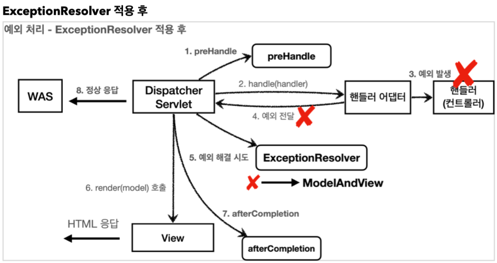

- `BasicErrorController`는 두 가지 오류 방식이 존재한다.
  - `errorHtml` : `produces = MediaType.TEXT_HTML_VALUE`로, 요청 헤더의 값이 `text/html`일 때 사용된다.
  - `error` : 그 외 경우 호출되고, `ResponseEntity`로 HTTP Body에 JSON 데이터를 반환한다.
  - API에는 잘 사용하지 않는다.

- `HandlerExceptionResolver`
  - 컨트롤러 밖으로 예외가 던져진 경우 예외를 해결한다.
  - 예외가 해결되어도 `postHandle()`은 호출되지 않는다.



## Spring Boot가 기본으로 제공하는 `ExceptionResolver` : `HandlerExceptionResolverComposite`에 다음 순서로 등록
1. `ExceptionHandlerExceptionResolver` : `@ExceptionHandler`를 처리
2. `ResponseStatusExceptionResolver` : HTTP 상태 코드를 지정 (`@ResponseStatus(value = HttpStatus.NOT_FOUND)`)
   - `@ResponseStatus`가 달려있는 예외 처리
   - `ResponseStatusException` 예외 처리
   - 내부에서 `sendError(400)`을 호출하기 때문에, 결국 WAS에서 다시 오류 페이지를 내부 요청한다.
```java
@ResponseStatus(code = HttpStatus.BAD_REQUEST, reason = "error.bad")
public class BadRequestException extends RuntimeException { 
    
}

// 외부 라이브러리에 사용하는 등 조건에 따라 동적으로 변경이 필요할 경우
@GetMaping("...")
public String responseStatusException() {
  throw new ResponseStatusException(HttpStatus.NOT_FOUND, "error.had", new IllegalArgumentException());
}
```
3. `DefaultHandlerExceptionResolver` : 스프링 내부 기본 예외를 처리
   - ex. `TypeMismatchException`
   - 내부에서 `sendError(400)`을 호출하기 때문에, 결국 WAS에서 다시 오류 페이지를 내부 요청한다.
