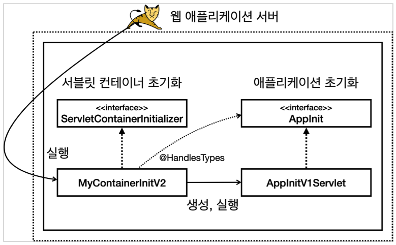
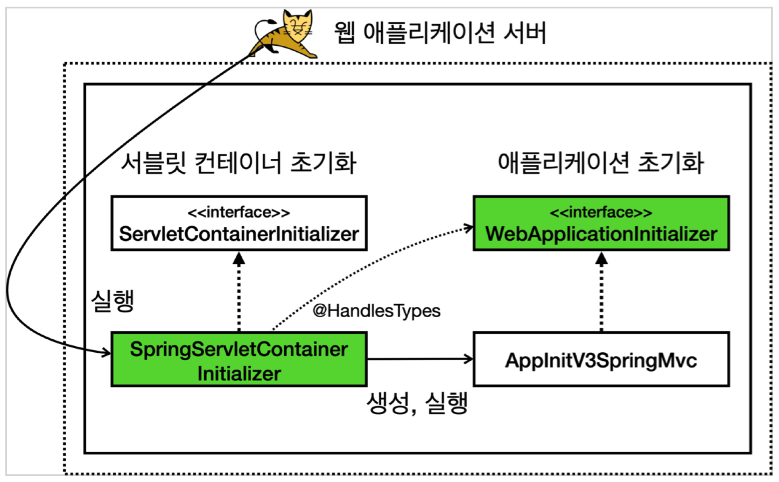
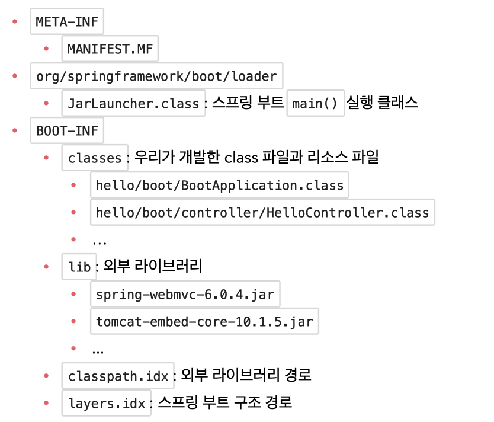
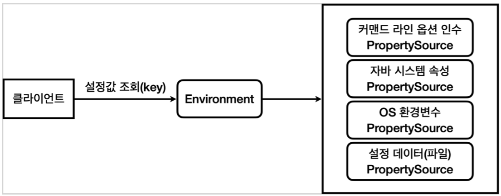
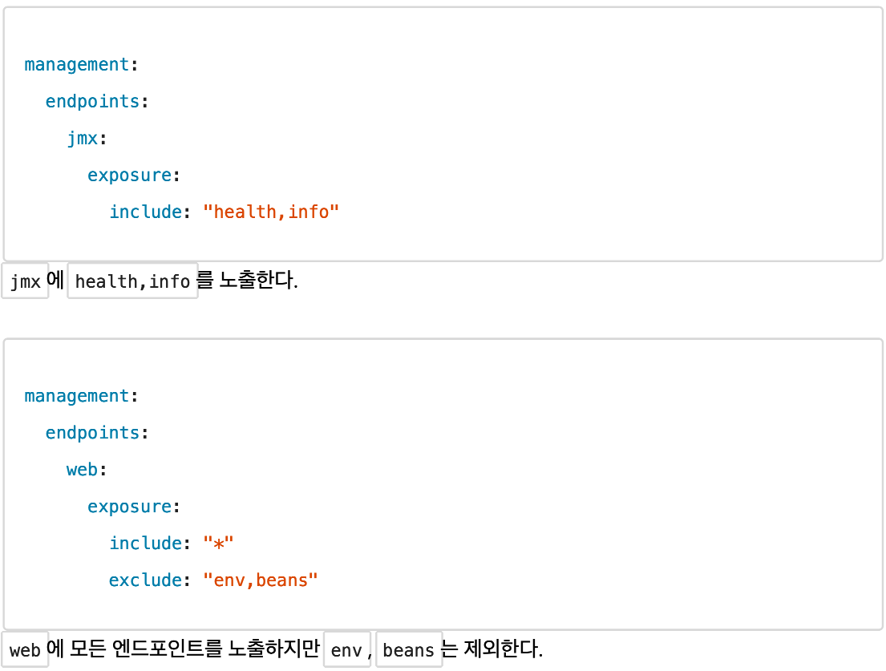
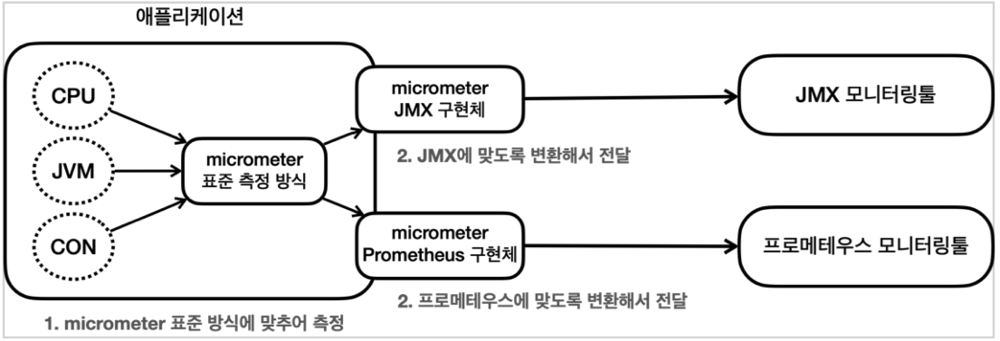
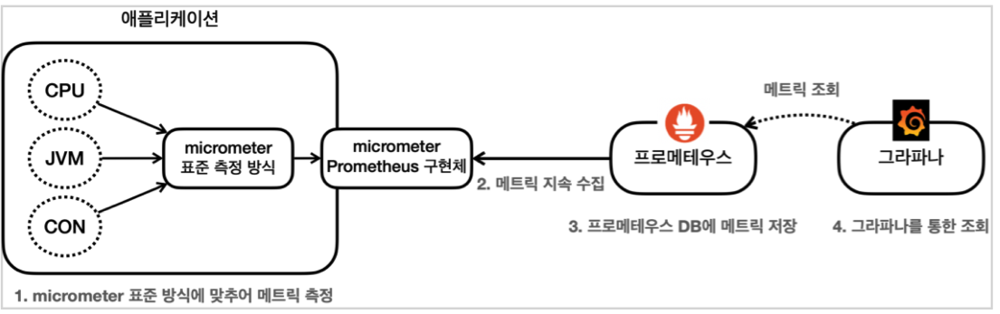

### 핵심기능
- WAS : 웹 서버를 내장해서 별도의 웹 서버 설치 X
- 라이브러리 관리 : 손쉬운 빌드, 스타터 종속성
- 자동 구성 : 프로젝트 시작에 필요한 스프링과 외부 라이브러리의 빈을 자동 등록
- 외부 설정 : 환경에 따라 달렺야 하는 외부 설정 공통화
- 프로덕션 준비 : 모니터링을 위한 메트릭, 상태 확인 기능 제공

### 웹 서버와 서블릿 컨테이너
- 과거
  - 서버에 톰캣(혹은 WAS)를 설치 후 서블릿 스펙에 맞춰 코드를 작성하고, WAR형식으로 빌드하여 war 파일을 만들었다.
  - 그리고 이 war파일을 WAS에 옮겨 배포하였다.
- 현재
  - 스프링 부트가 내장 톰캣을 포함하고 있다.
  - 개발자는 코드를 작성하고 JAR로 빌드 후 JAR를 원하는 위치에서 실행시키면 WAS도 함께 실행된다.
- JAR
  - 여러 클래스와 리소스를 묶어 `Java Archive`라는 압축 파일로 만든 것
  - JVM위에서 직접 실행되거나 라이브러리로 제공할 수 있음
  - 실행 : `java -jar abc.jar`
- WAR
  - 웹 애플리케이션 배포용 파일
  - WAR는 웹 애플리케이션 서버 위에서 실행됨
  - 구조를 지켜야 함
    - `WEB-INF`
      - `classes` : 실행 클래스 모음
      - `lib` : 라이브러리 모음
      - `web.xml` : 웹 서버 배치 설정 파일
    - `index.html` : 정적 리소스 

### 서블릿 컨테이너 초기화
- 서블릿은 `ServletContainerInitializer`라는 초기화 인터페이스를 제공, 서블릿 컨테이너는 실행 시점에 `onStartup()` 호출
  - 실행 인터페이스를 `resources/META-INF/services/jakarta.servlet.ServletContainerInitializer`에 등록 해야 함
- 애플리케이션 등록 방법
  1. `AppInit` 인터페이스의 `onStartup()`에 구현하는 방법(프로그래밍 방식)
    - 
    - `@HandlesTypes`로 애플리케이션 등록 필요
  2. `@WebServlet` 애노테이션을 사용하는 방법 -> 유연하지 못하다는 단점 존재
- 단계
  1. `ServletContainerIntializer`를 등록
  2. `ServletContainerIntializer`코드에 `@HandlesTypes`로 초기화할 애플리케이션 추가
  3. `ServletContainerInitializer`를 서블릿 컨테이너 초기화 클래스 경로로 등록

### 스프링 MVC 서블릿 컨테이너 초기화 지원
- `WebApplicationInitializer` 인터페이스를 구현하면 된다.
- `spring-web` 라이브러리에서 서블릿 컨테이너 초기화를 위한 파일 등록을 하고 있다.(`SpringServletContainerInitializer`)
  - `SpringServletContainerInitializer`의 내부를 보면, `@HandlesTYpes(WebApplicationInitializer.class)` 코드가 존재한다.
  - 
    - 초록색은 스프링이 이미 만들어서 제공하는 영역

### 스프링 부트와 내장 톰캣
- 기존 방식은, 톰캣을 별도로 설치해야 하고, 개발 환경이 복잡하며, 배포가 복잡하고, 톰캣 버전에 대한 민감성이 큼
- 내장 톰캣 라이브러리 : `implementation 'org.apache.tomcat.embed:tomcat-embed-core:10.1.5'`
- 내장 톰캣 기본 : `EmbedTomcatServletMain.java`
- 내장 톰캣 + 스프링 : `EmbedTomcatSpringMain.java`
- 내장 톰캣 빌드, 배포
  - `META-INF/MANIFEST.MF` 파일에 실행할 `main()` 메서드의 클래스를 지정, `jar` 형식으로 빌드
  - **중요** : `jar` 파일은 `jar` 파일을 포함할 수 없다. -> `FatJar` 방식 사용
  - `FatJar` : `Jar`안의 클래스들을 새로 만드는 `Jar`에 포함시키는 것
    - 단점
      - 어떤 라이브러리가 포함되어 있는지 알기 어렵다
      - 파일명 중복을 해결할 수 없다
- 간단하게 만들어보는 스프링 부트 시작점 : `MySpringBootMain.java` + `MySpringApplication.java` + `MySpringBootApplication.java`
  - 핵심
    - 스프링 컨테이너를 생성 : `ServletWebServerApplicationContextFactory.java` -> `AnnotationConfigServletWebServerApplicationContext()`(컨테이너 생성)
    - WAS(내장 톰캣)를 생성 : `TomcatServletWebServerFactory.java`의 `getWebServrer` -> `new Tomcat()`으로 톰캣을 만들고, 커넥터를 등록하고, 디스패처 서블릿을 등록
- 스프링 부트의 JAR(`Executable Jar`)를 푼 결과
  - 
- 스프링 부트는 "Executable Jar"를 사용한다.
  - `jar` 내부에 `jar`를 포함할 수 있다. -> `Fat Jar`의 문제점을 해결
  - 실행 동작 순서
    1. `META-INF/MANIFEST.MF` 파일을 찾는다.
    2. 여기에 있는 `Main-Class`를 읽어서 `main()` 메서드를 실행한다. (`JarLauncher`)
    3. `JarLauncher`가 특별한 구조에 맞게 클래스 정보를 읽어준다. (`BOOT-INF/classes/`, `BOOT-INF/lib/` 인식)
    4. `JarLauncher`의 작업이 끝난 후, `META-INF/MANIFEST.MF`에서 `Start-Class`의 `main()`를 실행한다.

### 스프링 부트 스타터와 라이브러리 관리
#### 라이브러리 관리
- 라이브러리를 직접 넣으면, 버전에 따른 관리가 발생
- 스프링 부트는 `io.spring.dependency-management` 플러그인으로 버전을 관리
- `bom(bill of materials)`정보에 버전이 명시되어 있고, 이 파일을 사용하여 버전이 관리 됨
- 스프링 부트의 버전에 맞게 자동으로 버전 관리
#### 스타터
- `starter`는 의존성을 모아둔 세트
- [스타터 목록](https://docs.spring.io/spring-boot/reference/using/build-systems.html#using.build-systems.starters)
- 외부 라이브러리의 버전을 변경하고 싶을 때(build.gradle) : ext['tomcat.version'] = '10.1.4' 
  - [버전 속성 값](https://docs.spring.io/spring-boot/appendix/dependency-versions/properties.html#appendix.dependency-versions.properties)

### 자동 구성(Auto Configuration)
- 스프링 부트는 일반적으로 자주 사용하는 빈들을 자동으로 등록해 준다.
- `spring-boot-autoconfigure` 프로젝트에 자동으로 등록하는 빈들이 존재한다.
  - ex. `JdbcTemplateAutoConfiguration.java`
  - `@ConditionalXXX`는 주로 특정 조건에 맞을 때 설정이 동작하도록 한다
  - 내부 애노테이션
    - `@AutoConfiguration` : 자동 구성을 위해 등록
      - 내부에 `@Configuration` 존재
      - `after=XXXAutoConfiguration.class`를 통해 순서 조정 가능
    - `@ConditionalOnClass({XXX.class})` : 이 클래스가 있는 경우에만 설정이 동작
    - `@Import` : 자바 설정을 추가 시 사용
    - `@ConditionalOnMissingBean(JdbcOperations.class)`
      - `JdbcOptions` 빈이 없을 때 동작
      - 개발자가 빈을 등록하지 않으면 자동으로 등록하기 위해 사용

#### `@Conditional`
- 스프링 프레임워크의 기능
- 특정 상황일 때만 특정 빈들을 등록해서 사용하도록 도와 준다.
- `@Condition`을 구현하는 클래스를 활용하여 조건을 지정할 수 있다.

#### `@ConditionalOnXxx`
- 스프링 부트의 기능
- 개발자가 편하게 사용할 수 있도록 스프링에서 제공
- 대표적인 몇가지
  - `@ConditionalOnClass`, `@ConditionalOnMissingClass` : 클래스가 있는 경우 동작O/X
  - `@ConditionalOnBean`, `@ConditionalOnMissingBean` : 빈이 등록되어있는 경우 동작O/X
  - `@ConditionalOnProperty` : 환경 정보가 있는 경우 동작
  - `@ConditionalOnResource` : 리소스가 있는 경우 동작
  - `@ConditionalOnWebApplication`, `@ConditionalOnNotWebApplication` : 웹 애플리케이션인 경우 동작
  - `@ConditionalOnExpression` : SpEL 표현식에 만족하는 경우 동작
- [ConditionalOn 가이드](https://docs.spring.io/spring-boot/reference/features/developing-auto-configuration.html#features.developing-auto-configuration.condition-annotations)

#### 직접 만든 라이브러리를 자동 구성에 추가
##### 라이브러리 프로젝트
- `MemoryAutoConfig.java`처럼, `@AutoConfiguration`으로 자동 구성설정임을 선언
- `src/main/resources/META-INF/spring/org.springframework.boot.autoconfiguration.AutoConfiguration.imports` 파일에 자동구성을 등록 해 주어야 한다.
  - 스프링 부트는 시작 지점에 위 파일의 정보를 읽어서 자동 구성으로 사용한다. (그 결과 내부의 `MemoryAutoConfig`가 자동으로 실행 됨)
##### 사용하는 프로젝트
- 추가하려는 jar파일을 사용하려는 프로젝트에 추가
- `build.gradle`의 `dependencies`에, `implementation files('libs/memory-v1.jar')`처럼 라이브러리 파일을 추가
- 자동 설정을 했기 때문에, 조건에 맞으면 라이브러리의 빈이 등록 됨

#### 스프링 부트 자동 구성 동작
- `@Import`
  - 정적인 방법
    - ex. `@Import({AConfig.class})`
    - 설정 사용할 대상을 동적으로 변경 불가
  - 동적인 방법
    - `ImportSelector`를 구현한 클래스를 동적으로 등록
- 구성 동작 순서
  1. `@SpringBootApplication` : 여러 설정 정보들이 존재
     - 이 컴포넌트 스캔에는 `@AutoConfiguration`을 제외하는 `AutoConfigurationExcludeFilter`가 존재 -> `META-INF/spring/org.springframework.boot.autoconfiguration.AutoConfiguration.imports`  파일에 등록해서 사용해야 함
  2. `@EnableAutoConfiguration` : 자동 구성 활성화
     - 내부에 `@Import(AutoConfigurationImportSelector.class)`가 존재
  3. `@Import(AutoConfigurationImportSelector.class)`
     - `AutoConfigurationImportSelector`는 `META-INF/spring/org.springframework.boot.autoconfiguration.AutoConfiguration.imports` 경로의 파일을 확인
     - 파일 내에 있는 설정 정보가 스프링 컨테이너에 등록되고 사용 됨

### 외부설정과 프로필
#### 외부설정 4가지
1. OS 환경 변수 : OS에서 지원하는 외부 설정, 해당 OS를 사용하는 모든 프로세스에서 사용
   - 테스트 : `OsEnv.java`
   - 전역변수의 느낌이기 때문에 해당 자바 프로그램만 사용하지 않는다.
2. 자바 시스템 속성 : 자바에서 지원하는 외부 설정, 해당 JVM 안에서 사용
   - 테스트 : `JavaSystemProperties.java`
3. 자바 커맨드 라인 인수 : 커맨드 라인에서 전달하는 외부 설정, 실행 시 `main(args)` 메서드에서 사용
   - `java -jar app.jar dataA dataB`와 같이 사용
   - 테스트 : `CommandLineV1.java`, `CommandLineV2.java`
   - `ApplicationArguments` 빈을 주입받아 사용할 수 있다.(스프링 부트가 자동으로 등록)
     - 테스트 : `CommandLineBean.java`
4. 외부 설정 : 프로그램에서 외부 파일을 직접 읽어서 사용

#### 스프링 외부 설정
##### 외부설정 추상화

- `Enviroment`와 `PropertySource` 추상화를 사용
  - `Environment` : 특정 외부 설정에 종속되지 않고, 일관성 있게 `key=value` 형식으로 외부 설정에 접근
  - 더 유연하거나, 범위가 좁은 설정이 우선순위를 가진다.
- 스프링 부트는 `application.properties`와 같은 설정 데이터를 통해 `PropertySource`의 구현체를 제공
  - `Environment`를 통해 조회가 가능
##### 환결별 외부설정 분리
- 환경별 설정 데이터를 나눠서, 환경에 따라 빌드되도록 함
  - 
  - `application-dev.properties`, `application-prod.properties`
  - `spring.profiles.active`에 {환경값}을 넣으면 `application-{환경값}.properties`를 설정 데이터로 사용한다.
    - ex. `--spring.profiles.active=dev`, `-Dspring.profiles.active=dev`
##### 내부 파일 일원화
- 환경별로 `application.properties`를 `#---` 혹은 `!---`로 구분 가능
- `application.yml`의 경우 `---`로 구분
- `spring.config.activate.on-profile`로 분리된 구분의 환경값을 세팅
- 일치하는 환경값이 없을 때, 기본값으로 적용 가능
  - 스프링은 문서를 위에서 아래로 순서대로 읽으면서 설정
  - 가장 처음에 프로필 정보에 `on-profile`을 설정하지 않으면, 프로필 지정과 무관하게 사용 됨(default)
  - 단순하게 위에서 값을 읽으며 내려가기 때문에, 가장 밑에 프로필 없는 설정값이 있다면 그 값은 항상 설정되게 됨
  - 위에서 아래로 내려가며 일치하는 속성값에 대해 값을 덮어 씀
- [설정 파일 공식문서](https://docs.spring.io/spring-boot/reference/features/external-config.html#features.external-config)
- [설정 우선순위](https://docs.spring.io/spring-boot/reference/features/external-config.html#features.external-config.files)
- 자주 사용하는 우선순위
  1. 설정 데이터(`application.properties`)
  2. OS 환경변수
  3. 자바 시스템 속성
  4. 커맨드 라인 옵션 인수
  5. `@TestPropertySource` (테스트 시)
- 설정 데이터 우선순위
  1. jar 내부 `application.properties`
  2. jar 내부 `application-{profile}.properties`
  3. jar 외부 `application.properties`
  4. jar 외부 `application-{profile}.properties`
- 보통 `application.properties`를 사용하다가 일부 속성을 변경할 필요가 있다면 높은 우선순위를 가지는 **자바 시스템 속성**이나 **커맨드 라인 옵션 인수**를 사용

#### 외부 설정 사용
##### Environment
- `MyDataSourceEnvConfig.java` 참조
- [설정 속성 변환기](https://docs.spring.io/spring-boot/redirect.html?page=features#features.external-config.typesafe-configuration-properties.conversion)
- 단점
  - `Environment`를 직접 주입받아야 함
  - 값을 꺼내는 과정을 반복해야 함
##### @Value
- 내부에서 `Environment`를 사용
- `MyDataSourceVAlueConfig.java` 참조
- 기본값을 사용할 수 있다.
  - `@Value("${my.datasource.etc.max-connection:1}")`의 경우, key가 없으면 1이 기본값이 된다.
##### @ConfigurationProperties
- **타입 안전한 설정 속성** : 외부 설정의 묶음 정보를 객체로 변환하는 기능 (외부 설정을 자바 코드로 관리)
- 타입에 맞지 않으면 컴파일 오류가 발생한다.
- `@ConfigurationProperties`를 통해 설정 값들을 읽어온다.
  - 하나하나 등록할 경우엔 `@ConfigurationProperties`를, 패키지 단위로 등록할 경우에는 `@EnableConfigurationProperties`를 사용
- 케밥케이스 -> 카멜케이스로 자동 변환한다.
- 일반적인 방법 참고 : `MyDataSourceConfigV1.java`, `MyDataSourcePropertiesV1.java`
  - `@Data`를 활용하여 Setter가 있고, 데이터 변경에 따른 문제가 발생할 수 있음
- 생성자를 통해 생성하는 방법 참고 : `MyDataSourcePropertiesV2.java`, `MyDataSourceConfigV1.java`
  - `@Getter`만 사용하고 생성자 주입을 받으므로 중간에 값이 변경될 위험이 없음
- 빈 검증기를 통해 값에 대한 검증이 가능
  - 참고 : `MyDataSourcePropertiesV3.java`, `MyDataSourceConfigV3.java`
  - `@Validated`와 빈 검증기를 사용해 속성들의 조건을 제한할 수 있다.

#### YAML 파일
- `application.properties`를 `application.yml`로 대체할 수 있음
- 두개를 같이 쓴다면 `application.properties`가 우선권을 가짐 (단, 그렇게 사용하지 않기)

#### @Profile
- 환경마다 다른 빈을 등록해야 하는 경우
- 참고 : `PayConfig.java`
- 해당 프로필이 활성화된 경우에만 빈을 등록
  - 프로필 세팅이 없는경우 스프링이 자체적으로 `default`로 세팅하고, `default` 프로파일의 빈을 선택한다.
- `@Profile` 내부에는 `@Conditional(ProfileCondition.class)`가 존재해서 프로필 조건에 따라 빈을 생성

### 액츄에이터
- `implementation 'org.springframework.boot:spring-boot-starter-actuator'` 추가 필요
  - `url/actuator`로 기능 제공
- 모든 옵션을 다 보이게 할 경우 `application.properties`에 `management.endpoints.web.exposure.include=*` 추가
- 외부 인터넷망에는 액츄에이터의 엔드포인트를 공개하지 않아야 한다.
  - 포트를 분리하려면 `management.server.port=9292` 처럼 변경할 수 있다.
  - 필터나 인터셉터, 스프링 시큐리티 등을 통해 인증된 사용자만 접근 가능하도록 추가해야 한다.
  - 엔드포인트 기본 경로를 변경하려면, `management.endpoints.web.base-path=/manage`처럼 변경하면 된다.
#### 엔드포인트 설정
- 엔드포인트 활성화
  - `shutdown`을 제외하면 대부분 기본 기능이 활성화 되어있음
  - `HTTP`와 `JMX` 중 어디에 어떤 엔트포인트를 노출할지 선택
  - 활성화하기 위해 `management.endpoints.{엔드포인트명}.enabled=true` 적용
- 엔드포인트 노출
  - 노출하기 위해 `management.endpoints.web.exposure.include=...` 적용 
- 
- [엔드포인트 공식 메뉴얼](https://docs.spring.io/spring-boot/reference/actuator/endpoints.html#actuator.endpoints)
  - `beans` : 스프링 컨테이너에 등록된 스프링 빈을 보여줌
  - `conditions` : `condition`을 통해 빈을 등록할 때 평가 조건과 일치하거나 일치하지 않는 이유를 표시
  - `configprops` : `@ConfigurationProperties`를 보여줌
  - `health` : 애플리케이션 헬스 정보를 보여줌
  - `httpexchanges` : HTTP 호출 응답정보를 보여줌. `HttpExchangeRepository`를 구현한 빈을 별도로 등록해야 함
  - `info` : 애플리케이션 정보를 보여줌
  - `loggers` : 애플리케이션 로거 설정을 보여주고, 변경 가능
  - `metrics` : 애플리케이션의 메트릭 정보를 보여줌
  - `mappings` : `@RequestMapping` 정보를 보여줌
  - `threaddump` : 쓰레드 덤프를 실행해서 보여줌
  - `shutdown` : 애플리케이션을 종료(기본적으로 비활성화)
#### 헬스 정보
- `http://localhost:8080/actuator/health`
- 헬스 상세 정보 : `management.endpoint.health.show-details=always`
- 헬스 상세 간략히 노출 : `management.endpoint.health.show-components=always`
- [헬스 기본 지원 기능 메뉴얼](https://docs.spring.io/spring-boot/reference/actuator/endpoints.html#actuator.endpoints.health.auto-configured-health-indicators)
- [헬스 직접 구현 메뉴얼](https://docs.spring.io/spring-boot/reference/actuator/endpoints.html#actuator.endpoints.health.writing-custom-health-indicators)
#### 애플리케이션 정보
- `http://localhost:8080/actuator/info`
- `java` : 자바 런타임 정보 (기본 비활성화)
- `os` : OS 정보 (기본 비활성화)
- `env` : `Environment`에서 `info.`로 시작하는 정보 (기본 비활성화)
  - `info.app.name=hello-actuator`
  - `info.app.company:yh`
- `build` : 빌드 정보, `META-INF/build-info.properties` 파일이 필요
  - `build.gradle`에 `springBoot { buildInfo() }`를 사용하면 `build-info.properties` 파일 활성화
- `git` : `git` 정보, `git.properties` 파일이 필요
  - `build.gradle`에 `plugins { id "com.gorylenko.gradle-git-properties" version "2.4.1" }` 추가
  - `resources/main/git.properties` 파일 내 정보 표기
  - 프로젝트가 `git`으로 관리되고 있어야 함
  - 더 자세한 정보를 추가하고 싶다면 `management.info.git.mode=full`을 사용
- `management.info.java.enabled=true`처럼 활성화 시켜주어야 함
#### 로거
- `http://localhost:8080/actuator/loggers`
- 특정 로거 이름 조회 : `http://localhost:8080/actuator/loggers/firewoody.learnspring.boot.actuator.HelloController`
- `application.properties`에 `logging.level.firewoody.learnspring.boot.actuator.HelloController=debug` 와 같이 로그 레벨을 설정
- `POST`를 사용해, 특정 로거에 `JSON`을 전달하면 서버를 재기동 하지 않고 로그레벨을 바꿀 수 있다.
  - url : `http://localhost:8080/actuator/loggers/firewoody.learnspring.boot.actuator.HelloController`
  - json : `{ "configuredLevel":"TRACE" }`
#### HTTP 요청 응답 기록
- HTTP 요청과 응답의 과거 기록 확인
- `HttpExchangeRepository` 빈 등록 필요 (스프링은 `InMemoryHttpExchangeRepository` 구현체를 제공)
- 예시 : `ActuatorApplicationConfig.java`
- 단순하고 제한이 많아서 개발 단계에서만 사용하는 것이 좋음

### 모니터링 툴
- 모니터링 툴이 필요한 지표들을 전달 해 주어야 한다.
- 스프링은 `micrometer`를 사용해 여러 모니터링 툴에 대한 사용을 "추상화" 한다.

- `Actuator`는 `micrometer`를 기본으로 내장해서 사용한다.
- [마이크로미터가 지원하는 모니터링 툴](https://micrometer.io/docs/)
- 스프링 부트 액츄에이터는 마이크로미터가 제공하는 지표 수집을 `@AutoConfiguration`을 통해 자동으로 등록
- 매트릭 확인 예시
  - `http://localhost:8080/actuator/metrics/{name}`
  - `http://localhost:8080/actuator/metrics/jvm.memory.used?tag=area:heap`
  - `http://localhost:8080/actuator/metrics/http.server.requests?tag=uri:/log&tag=status:200`
#### 메트릭
- JVM 메트릭
  - `jvm.`으로 시작
  - 메모리 및 버퍼 풀 세부 정보
  - 가비지 수집 관련 통계
  - 스레드 활용
  - 로드 및 언로드된 클래스 수
  - JVM 버전 정보
  - JIT 컴파일 시간
- 시스템 메트릭
  - `system.`, `process.`, `disk.`로 시작
  - CPU 지표
  - 파일 디스크립터 메트릭
  - 가동 시간 메트릭
  - 사용 가능한 디스크 공간
- 애플리케이션 시작 메트릭
  - `application.started.time` : 애플리케이션을 시작하는데 걸리는 시간 (`ApplicationStartedEvent` 로 측정)
  - `application.ready.time` : 애플리케이션이 요청을 처리할 준비가 되는데 걸리는 시간 (`ApplicationReadyEvent`로 측정)
- 스프링 MVC 메트릭
  - `http.server.requests` : 스프링 MVC 컨트롤러가 처리하는 모든 요청
  - tag : `uri`, `method`, `status`, `exception`, `outcome(상태코드 그룹)`
- 톰캣 메트릭
  - `tomcat.`로 시작
  - `application.properties`의 `server.tomcat.mbeanregistry.enabled=true` 옵션을 켜야 함
- 데이터 소스 메트릭
  - `jdbc.connections.`
  - `hikaricp.` : 히카리 커넥션풀을 사용하는 경우
- 로그 메트릭
  - `logback.events` : 로그백 로그에 대한 메트릭
- 사용자 정의 메트릭
- 기타
  - HTTP 클라이언트 매트릭(`RestTemplate`, `WebClient`)
  - 캐시 메트릭
  - 작업 실행과 스케줄 매트릭
  - 스프링 데이터 리포지토리 메트릭
  - 몽고 DB 메트릭
  - 레디스 메트릭

#### 프로메테우스
- 수집된 메트릭을 보관하는 DB
- 일반적을 `9090` 포트를 사용
- 프로메테우스를 위한 메트릭 포맷 제공을 위해 `build.gradle`에 추가 : `implementation 'io.micrometer:micrometer-registry-prometheus'`
  - 추가 후 확인 가능 : `http://localhost:8080/actuator/prometheus`
  - 포맷 
    - `.` 대신 `_` 사용
    - `logback.events` -> `logback_events_total` 숫자 증가 메트릭(카운터)는 `_total` 사용
    - `http.server.requests`는 아래 3가지로 분리
      - `http_server.requests_seconds_count` : 요청 수
      - `http_server.requests_seconds_sum` : 시간 합
      - `http_server.requests_seconds_max` : 최대 시간
  - 아래 코드를 `prometheus.yml`에 추가
```yaml
scrape_configs:
  ...
  - job_name: "spring-actuator"
  metrics_path: '/actuator/prometheus'
  scrape_interval: 1s # 대부분 10s ~ 1m를 권장
  static_configs:
    - targets: ['localhost:8080']
```
- 참고 : 도커가 아닌 다운로드로 열 때, `./prometheus --config.file=prometheus.yml` 처럼 설정 파일의 path를 지정할 수 있음
- 사용 방법
  - 필터
    - 중괄호(`{}`) 문법을 사용
    - `=` : 문자열과 정확히 동일한 레이블 선택
      - ex. `http_server_requests_seconds_count{uri="/log", method="GET"}`
    - `!=` : 문자열과 같지 않은 레이블 선택
      - ex. `http_server_requests_second_count{uri!="/actuator/prometheus"}`
    - `=~` : 제공된 문자열과 정규식 일치하는 레이블 선택
      - ex. `http_server_requests_second_count{method=~"GET|POST"}`
    - `!~` : 제공된 문자열과 정규식 일치하지 않는 레이블 선택
      - ex. `http_server_requests_second_count{uri!~"/actuator/*"}`
  - 함수
    - `sum` : 합계
      - ex. `sum(http_server_requests_seconds_count)`
    - `sum by`
      - ex. `sum by(method, status)(http_server_requests_seconds_count)`
    - `count`
      - ex. `count(http_server_requests_seconds_count)`
    - `topk` : 상위 메트릭
      - ex. `topk(3, http_server_requests_seconds_count)`
    - 오프셋 수정자 : 현재를 기준으로 특정 시점의 데이터를 반환
      - ex. `http_server_requests_seconds_count offset 10m`
    - 범위 벡터 선택기 : 지난 N기간 간의 모든 기록값을 선택
      - ex. `http_server_requests_seconds_count offset[1m]`
  - 게이지
    - 임의로 오르내릴수 있는 값 (CPU 사용량, 메모리 사용량, 사용중인 커넥션 등)
  - 카운터
    - 단순하게 증가하는 단일 누적 값 (HTTP 요청 수, 로그 발생 수)
    - 지원 함수
      - `increase()` : 지정한 시간 단위별 증가 확인
        - ex. `increase(http_server_requests_seconds_count{uri="/log"}[1m])`
      - `rate()` : 범위 벡터에서 초당 평균 증가율 계산
        - ex. `rate(data[1m])` : 60으로 나눈 수 
      - `irate()` : 범위 벡터에서 초당 순간 증가율 계산
- 공식 문서
  - [기본기능](https://prometheus.io/docs/prometheus/latest/querying/basics/)
  - [연산자](https://prometheus.io/docs/prometheus/latest/querying/operators/)
  - [함수](https://prometheus.io/docs/prometheus/latest/querying/functions/)

#### 그라파나
- 프로메테우스에 저장된 메트릭을 사용자에게 보여주는 대시보드

- 일반적으로 `3000` 포트를 사용 (기본 계정 : `admin/admin`)
- 참고 : 도커가 아닌 다운로드로 열 때, `./grafana-server.exe --config /defaults.ini --homepath /grafana` 처럼 설정 파일의 path를 지정할 수 있음
- 미리 제공되는 대시보드도 사용 가능하다 : [사전 제공 대시보드](https://grafana.com/grafana/dashboards/)

### 커스텀 메트릭 등록
- `MeterRegistry`가 마이크로미터 기능을 제공하는 핵심 컴포넌트이다.
- `Couter` : 단조롭게 증가하는 단일 누적 측정항목(누적값)
- `Gauge` : 임의로 오르내릴 수 있는 단일 숫자 값(증가하거나 감소)
- `Timer` : `Counter`기능에 추가적으로 시간을 측적
- 커스텀 메트릭 : `MeterReigstry`를 주입받아 사용하는 방법
  - `ActuatorOrderServiceV1.java`처럼 등록하면, `http://localhost:8080/actuator/metrics/my.order` 에서 확인 가능
- 커스텀 메트릭 : AOP 사용하는 방법
  - `CountedAsepect`를 등록하면, `@Counted` 어노테이션을 인지 (반드시 등록해야 함)
  - `ActuatorOrderServiceV2.java`
  - `result`, `exception`, `method`, `class` 같은 다양한 `tag`를 자동으로 적용
- 커스텀 메트릭 : `Timer`
  - 시간을 측정하는데 사용
  - 카운터와 유사하지만 실행 시간도 함께 측정 해 줌
  - `seconds_count` : 누적 실행 수
  - `seconds_sum` : 실행 시간의 합
  - `seconds_max` : 최대 실행 시간
  - `ActuatorOrderServiceV3.java`
- 커스텀 메트릭 : `@Timed`
  - `TimedAspect`르 등록하면, `@Timed`에 AOP가 적용 됨
  - `ActuatorOrderServiceV4.java`
- 커스텀 메트릭 : 게이지
  - 임의로 오르내릴 수 있는 단일 수자 값
  - 값의 현재 상태를 보는데 사용 (증가하거나 감소할 수 있음)
  - `ActuatorOrderConfigV1.java`
- 커스텀 메트릭 : 게이지 간단하게 등록
  - `ActuatorOrderConfigV2.java`
- `Tag`는 카디널리티가 낮으면서 그룹화 할 수 있는 단위에 사용해야 한다.
  - ex. 성별, 주문 상태, 결제 수단 등
- 알람은 경고와 심각을 잘 구분해야 함
