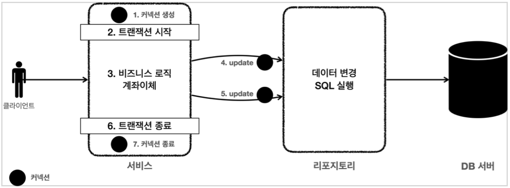
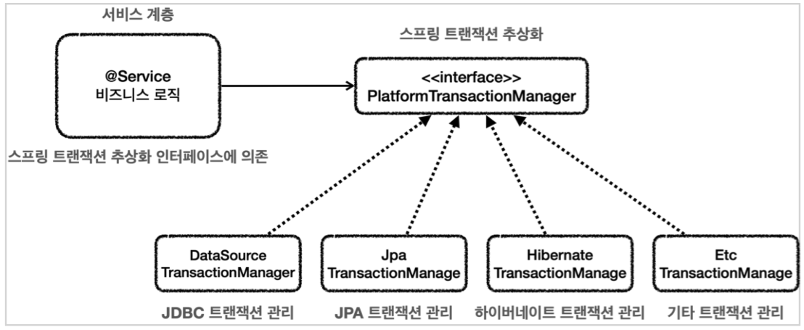
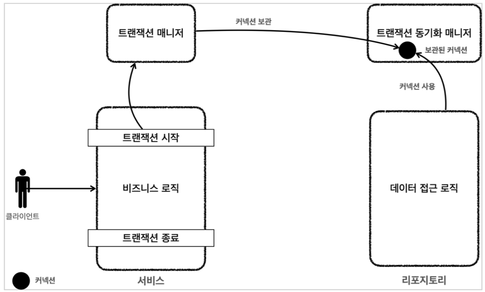
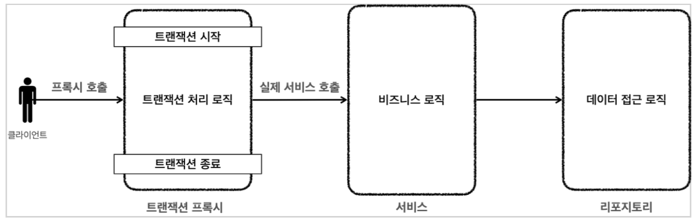
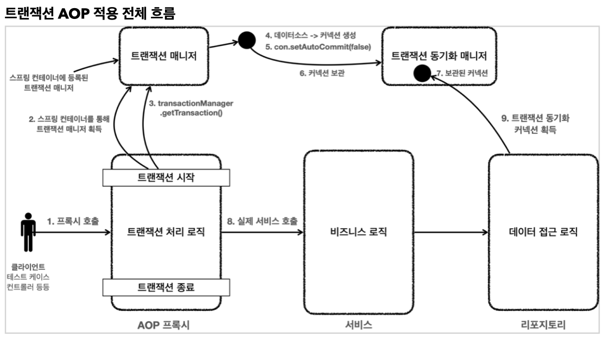
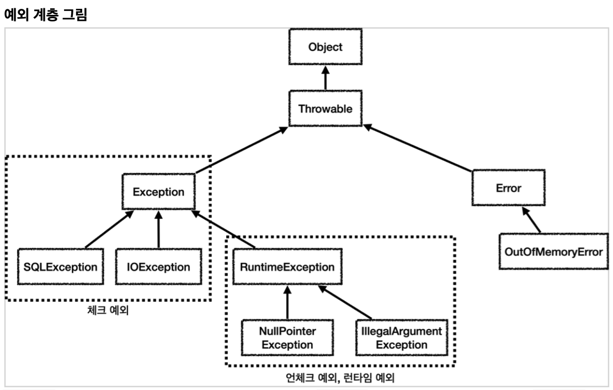
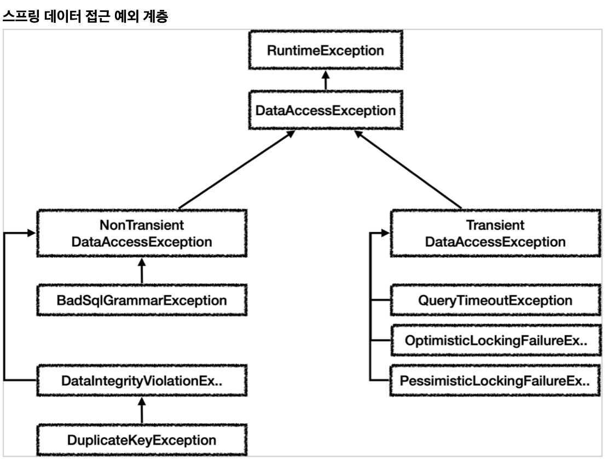
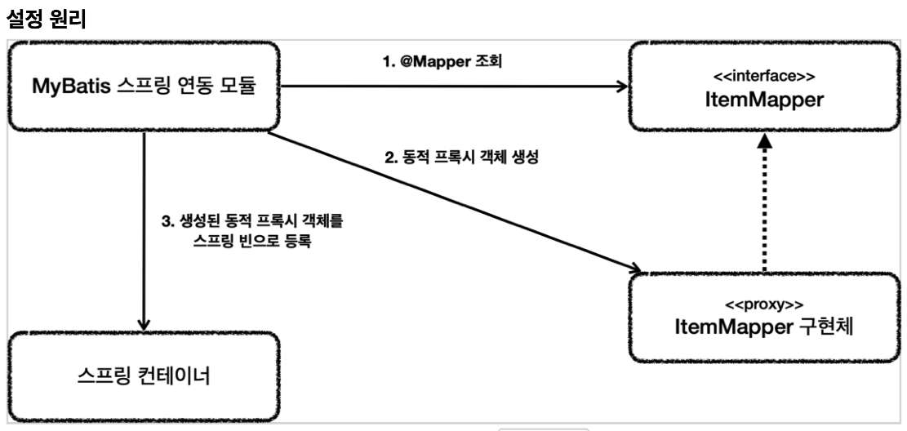

### 개요
- 데이터베이스마다 사용하는 방법이 모두 다르다.
  - 데이터베이스를 변경하려면 애플리케이션 서버의 코드도 함께 변경되어야 한다.
  - 개발자가 연결 방법을 새롭게 학습해야 한다.
- JDBC 표준 인터페이스 등장
  - `java.sql.Connection` : 연결
  - `java.sql.Statement` : SQL
  - `java.sql.ResultSet` : SQL 요청 응답
  - JDBC 인터페이스에 맞는 `JDBC 드라이버`를 각 벤더사에서 개발한다.
  - 애플리케이션 서버의 코드는 JDBC 표준 인터페이스에만 의존하면 된다.
  - 하지만 복잡하고, 각 DB에 맞는 SQL을 맞추기가 어렵다.
- `SQL Mapper`, `ORM` 등장
  - `SQL Mapper` : 스프링 JdbcTemplate, MyBatis
  - `ORM` : JPA, 하이버네이트, 이클립스링크
  - 내부적으로는 JDBC를 사용한다. -> 동작에 대해 알아야 한다.

### JDBC

- `DriverManager.getConnection()`을 호출하면, URL정보를 통해 처리할 수 있는 요청인지 확인한다. 그리고 커넥션을 획득해 반환한다.

### Connection-Pool
- DB 커넥션을 새로만드는건 복잡하고 시간이 많이 걸린다.
- 커넥션을 미리 만들어두고, 커넥션 풀에 저장하여 사용한다.
- 어플리케이션은 커넥션을 사용하고, 종료하지 않은채 반환한다.
- `commons-dbcp2`, `tomcat-jdbc pool`, `HikariCP` 등이 있다.
- DriveManager나, Connection Pool 모두 커넥션을 획득하는 방법이 다르므로, 자바는 `javax.sql.DataSource` 인터페이스를 제공한다.(추상화)
- 설정과 사용의 분리를 제공한다.

### Transaction
- 트랜잭션이 보장하는 `ACID`
  - 원자성 : 트랜잭션은 모두 성공하거나 모두 실패
  - 일관성 : 트랜잭션은 일관성 있는 데이터베이스 상태를 유지
  - 격리성 : 트랜잭션은 서로 영향을 미치지 않음
  - 지속성 : 트랜잭션을 성공적으로 끝내면 항상 그 결과가 기록
- 트랜잭션 격리 수준
  - `READ UNCOMMITED` : 커밋되지 안히은 읽기
  - `READ COMMITED` : 커밋된 읽기
  - `REPEATABLE READ` : 반복 가능한 읽기
  - `SERIALIZABLE` : 직렬화 가능
- 데이터베이스 연결 구조
  - 클라이언트는 데이터베이스와 커넥션을 맺는다.
  - 데이터베이스는 세션을 만들고, 이 커넥션을 통한 모든 요청은 해당 세션을 통해 실행한다.
  - 커넥션을 닫거나 세션을 강제로 종료하면 세션은 종료된다.
- 트랜잭션
  - 자동 커밋 : `set autocommit true;`
  - 수동 커밋 : `set autocommit false;`
- DB 락
  - 트랜잭션의 원자성을 보장한다.
  - 락을 가지고 있는 동안, 다른 트랜잭션에서 데이터 수정을 하지 못한다.
  - 일반적으로 조회느 락을 사용하지 않는다.
    - `for update`로 강제로 락을잡을 수 있다.
- 트랜잭션 위치
  - 
  - 트랜잭션은 비즈니스 로직이 있는 서비스 계층에서 시작해야 한다.(비즈니스 문제 시 롤백 필요)
  - 트랜잭션을 사용하는 동안 같은 커넥션을 유지해야 한다.
  - 서비스 계층은 중요한 비즈니스 로직을 담고 있으므로, 특정 기술에 종속적이지 않게 개발해야 한다.
  - 기술이 변경되더라도, 서비스 계층의 코드 변경은 발생하지 않도록 해야한다.
- `PlatformTransactionManager`
  - 
  - 스프링은 트랜잭션 추상화 기술을 제공한다.
- 트랜잭션 동기화 매니저
  - 
  - 스프링은 트랜잭션 동기화 매니저를 제공한다.
    - `ThreadLocal`을 사용해 커넥션을 동기화한다.(멀티스레드에 안전)
  - "트랜잭션 매니저"는, "트랜잭션 동기화 매니저"에 커넥션을 보관한다.
  - 레포지 토리는 이 "트랜잭션 동기화 매니저"에서 커넥션을 꺼내 사용한다.
- 트랜잭션 AOP
  - 
  - 트랜잭션은 중요한 기능이므로, 스프링은 트랜잭션 AOP를 처리하기 위한 기능을 제공한다.
  - 트랜잭션 처리가 필요한 곳에 `@Transactional`을 붙이면 된다.
    - 스프링 부트를 사용하면 자동으로 등록되지만, 어드바이저, 포인트컷, 어드바이스 빈을 필요로한다.
  - 
  - 선언적 트랜잭션 관리 : `@Transactional`을 통한 트랜잭션 관리 (대부분의 경우 사용)
  - 프로그래밍 방식의 트랜잭션 관리 : 트랜잭션 매니저 또는 트랜잭션 템플릿 등을 사용한 트랜잭션 관리
- 스프링 부트 자동 리소스 등록
  - 데이터 소스
    - `application.properties`의 `spring.datasource.~~`
    - 스프링은 기본적으로 `HikariDataSource`를 제공
  - 트랜잭션 매니저
    - 현재 등록된 라이브러리를 보고 어떤 트랜잭션 매니저르 선택할지 판단
  - 직접 등록할 경우, 직접 등록한 설정이 우선적으로 사용된다.

### DB Exception
#### Java 기본 예외
- 
- 예외 기본 규칙
  - 예외는 잡아서 처리하거나 던져야 한다.
  - 예외를 잡거나 던질 때 지정한 예외뿐만 아니라 그 예외의 자식들도 함께 처리된다.
- 체크 예외
  - 처리거나, 던지거나 둘 중 하나를 반드시 해야한다. (컴파일 시점)
  - 덕분에 개발자가 누락하지 않을 수 있다. 하지만 개발자가 모두 처리해줘야 하니 번거롭다.
- 언체크 예외
  - 예외를 잡아 처리하지 않아도 된다.
  - 신경쓰고 싶지 않은 예외들을 무시할 수 있지만, 실수로 누락할수도 있다.
- 체크예외는 보통 사용자에게 어떤 문제가 발생했는지 설명하기 어렵고, 서비스나 컨트롤러에서 처리하기 어려운 예외가 대부분이다.
  - 대부분의 체크 예외는 복구 불가능해서, `ControllerAdvice`에서 처리한다.
  - 처리하기 어려운 예외이므로 상위 계층으로 던지게되고, 그럼으로써 계층들이 `SQLException`과 같은 특정기술들에 종속되게 된다.
  - 체크 예외보다 언체크 예외를 활용하면, 위와 같은 문제를 없앨 수 있다.
  - 그렇기에 런타임 예외는 문서화가 중요하다.
- 예외 포함과 스택 트레이스
  - 예외를 전환하려면, 꼭 기존 예외를 포함시킨다. 그래야 스택 트레이스 확인이 가능하다.

#### 순수한 서비스를 위한 예외처리
- 방법 1.
  - 체크 예외를 언체크 예외로 감싸서 던진다. (체크 예외가 반드시 포함되어야 한다. - `MyDbException(e)`)
- 방법 2.
  - DB 오류는 오류코드(errorCode)를 던지고, 이를 통해 어떤 문제가 발생했는지 확인할 수 있다.
  - 하지만 같은 오류라도, 다른 DB라면 에러코드가 다르다.
- 방법 3. 스프링의 예외 추상화
  - 
  - 어떤 DB든 스프링이 제공하는 예외를 사용하면 된다.
  - `Transient` 예외는 일시적으로, 재시도하면 성공할 가능성이 있다.
  - `NonTransient`는 비일시적으로, 반복해도 실패한다.
  - `SQLExceptionTranslator`를 사용한다.
  - 스프링은 `org.springframework.jdbc.support.sql-error-codes.xml` 파일에 이미 에러들을 정리 해 두었다. 

### JdbcTemplate으로 반복 제거
- `MemberRepositoryV5` 참고
- `JdbcTemplate`을 사용하면 "트랜잭션 커넥션 동기화"는 물론, 예외 발생 시 "스프링 예외 변환기"도 자동으로 실행한다.

### 데이터 접근 기술
- SQL Mapper : JdbcTemplate, MyBatis
- ORM : JPA, Hibernate, 스프링 데이터 JPA, Querydsl

#### JdbcTemplate
- 설정이 편리하다
- 템플릿 콜백 패턴으로 반복 작업을 대신 처리 해준다.
- 동적 SQL을 해결하기 어렵다.
- 템플릿 종류
  - `JdbcTemplate` : 일반적인 순서기반 파라미터 바인딩의 JdbcTemplate -> `JdbcTemplateRepositoryV1`
  - `NamedParameterJdbcTemplate` : 이름을 지정해서 파라미터를 바인딩하는 JdbcTemplate -> `JdbcTemplateRepositoryV2`
    - 이름 지정 바인딩에 사용되는 것
      - `Map`
      - `SqlParameterSource`
        - `MapSqlParameterSource`
        - `BeanPropertySqlParameterSource`
  - `SimpleJdbcInsert` : InsertSQL을 작성하지 않아도 되도록 편리한 기능을 제공 - `JdbcTemplateRepositoryV3`
  - `SimpleJdbcCall` : 스토어드 프로시저를 편리하게 호출
- 메서드 종류
  - `queryForObject` : 단건 조회
  - `query` : 목록 조회
  - `update` : insert, update, delete, 프로시저 호출
  - `execute` : 임의의 SQL 실행 혹은 DDL에 사용

#### DB 테스트
- 테스트의 중요한 원칙
  - 테스트는 다른 테스트와 격리해야 한다.
  - 테스트는 반복해서 실행할 수 있어야 한다.
- `@Transactional`은 테스트에서 사용하면 테스트 종료 시 자동으로 롤백시켜준다.
  - `@Commit`을 붙이면 종료 후 롤백 대신 커밋이 호출된다.
- 임베드 모드 : 아래와 같이 사용하면, DB 임베드 모드를 사용할 수 있다.
  - `@Profile("test")` + `setUrl("jdbc:h2:m2m:db;DB_CLOSE_DELAY=-1")`
  - `src/test/resources/schema.sql`에 애플리케이션 로딩 시점의 쿼리를 미리 넣어놓을 수 있다.
- 스프링부트는 DB에 대한 별도 설정이 없으면, 임베디드 데이터베이스를 사용한다.

#### MyBatis
- `mybatis-spring-boot-starter` 필요
- `#{}` 문법은 `PreparedStatement`를 사용한다.
- 파라미터가 2개 이상이라면 파라미터를 `@Param`을 통해 구분 해 주어야 한다.
- `select`의 결과를 편리하게 객체로 바로 변환 해 준다.
- 문법
  - `if`는 해당 조건이 만족하면 구문을 추가한다.
  - `where`은 `if`가 모두 실패하면 `where`을 만들지 않고, 하나라도 성공하면 처음 나타나는 `and`를 `where`로 변환 해 준다.
  - `chose` + `when` + `otherwise` : `switch` + `case` + `default`와 비슷하다.
  - `foreach` : 컬렉션을 반복처리할때 사용
  - `sql` + `include`를 통해 쿼리 조각을 재사용 할 수 있다.
- XML이기 때문에 꺽쇄를 인식한다. 따라서 `<![CDATA[ <= ]]>`와 같은 방법을 사용한다.
- 구현체가 없어도 되는 이유
  - 애플리케이션 로딩 시점에 `@Mapper`를 조사하여 동적 프록시 객체를 생성하고, 그 구현체를 스프링 빈으로 등록한다.
    - 
- 어노테이션으로 SQL을 작성할 수 있게 해준다.
  - ex. `@Select("select id, item_name, price, quantity from item where id=#{id}`)`
  - `@Insert`, `@Update`, `@Delete`, `@Select` 등이 있다.
  - 동적 쿼리는 불가능하기에, 간단한 부분에 대해서만 사용한다.
- 이름의 `as` 별칭을 사용해서 직접 매핑하거나, `resultMap`을 사용해 별칭을 사용하지 않고 매핑할 수 있다.

#### JPA
- 자동으로 객체의 카멜케이스를 언더 스코어로 매핑해준다.
- JPA는 트랜잭션이 커밋되는 시점에 변경 엔티티를 확인하여 변경되는 객체가 있는경우 update sql을 실행한다.(영속성 컨텍스트)
- `JPQL`은 복잡한 조건 대상일 때 주로 사용하며, 엔티티 객체를 대상으로 SQL을 실행한다.
- JPA 예외
  - JPA는 `PersistenceException`과 그 하위 예외를 발생시킴
  - `@Repository`를 통해 `DataAccessException`으로 변환할 수 있음.
  - `@Repository`에 "예외 변환 AOP Proxy"가 `DataAccessException`으로 변환시켜준다.
  - 스프링 부트의 자동으로 등록되는 `PersistenceExceptionTranslationPostProcessor`가 `@Repository`를 AOP 프록시로 만드는 어드바이저를 등록한다.
  - 실제 예외를 변환하는 코드는 `EntityManagerFactoryUtils.convertJpaAccessExceptionIfPossible()`이다.
