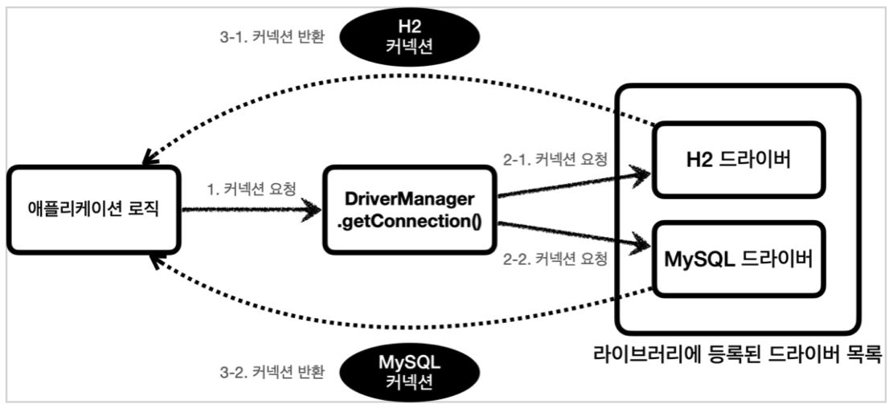

### 개요
- 데이터베이스마다 사용하는 방법이 모두 다르다.
  - 데이터베이스를 변경하려면 애플리케이션 서버의 코드도 함께 변경되어야 한다.
  - 개발자가 연결 방법을 새롭게 학습해야 한다.
- JDBC 표준 인터페이스 등장
  - `java.sql.Connection` : 연결
  - `java.sql.Statement` : SQL
  - `java.sql.ResultSet` : SQL 요청 응답
  - JDBC 인터페이스에 맞는 `JDBC 드라이버`를 각 벤더사에서 개발한다.
  - 애플리케이션 서버의 코드는 JDBC 표준 인터페이스에만 의존하면 된다.
  - 하지만 복잡하고, 각 DB에 맞는 SQL을 맞추기가 어렵다.
- `SQL Mapper`, `ORM` 등장
  - `SQL Mapper` : 스프링 JdbcTemplate, MyBatis
  - `ORM` : JPA, 하이버네이트, 이클립스링크
  - 내부적으로는 JDBC를 사용한다. -> 동작에 대해 알아야 한다.

### JDBC

- `DriverManager.getConnection()`을 호출하면, URL정보를 통해 처리할 수 있는 요청인지 확인한다. 그리고 커넥션을 획득해 반환한다.

### Connection-Pool
- DB 커넥션을 새로만드는건 복잡하고 시간이 많이 걸린다.
- 커넥션을 미리 만들어두고, 커넥션 풀에 저장하여 사용한다.
- 어플리케이션은 커넥션을 사용하고, 종료하지 않은채 반환한다.
- `commons-dbcp2`, `tomcat-jdbc pool`, `HikariCP` 등이 있다.
- DriveManager나, Connection Pool 모두 커넥션을 획득하는 방법이 다르므로, 자바는 `javax.sql.DataSource` 인터페이스를 제공한다.(추상화)
- 설정과 사용의 분리를 제공한다.
