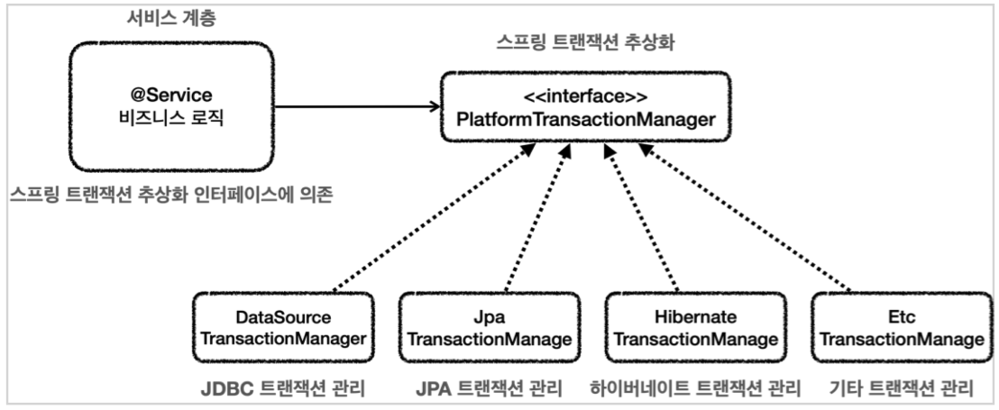
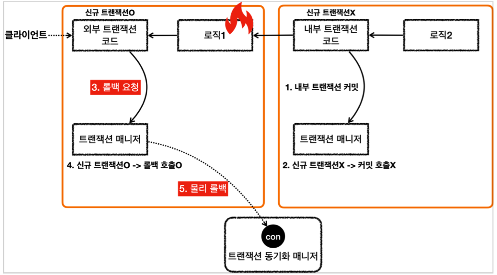

### 기본
- 다양한 DB 기술들(`Jdbc`, `JPA`...)의 트랜잭션 사용을 추상화 하기 위해, 스프링은 `PlatformTransactionManager` 인터페이스로 트랜잭션을 추상화 한다.
  - 
- 위와 같이 제공하기 때문에, 적절한 트랜잭션 매니저를 선택하고 구현체를 스프링 빈으로 등록해서 사용하기만 하면 된다.
- 트랜잭션 매니저를 선택하지 않아도, 알아서 매니저를 선택해서 스프링 빈으로 등록 해 준다.
- 선언적 트랜잭션(`@Transactional`)사용 시 프록시를 사용하여, 서비스 로직을 분리 할 수 있다.
  - 
- 그렇게 프록시 도입 후, 트랜잭션 동기화 매니저를 통해 트랜잭션을 관리할 수 있게 되었다.
  - 
- 스프링 트랜잭션 테스트 : `TxBasicTest.java`
  - 
  - `boolean txActive = TransactionSynchronizationManager.isActualTransactionActive();`를 통해 현재 쓰레드에 트랜잭션이 적용되어있는지 확인할 수 있다.

### 트랜잭션 적용 위치
- 항상 더 구체적이고 자세한 것이 높은 우선순위를 가진다.
- 테스트 : `TxLevelTest.java`
- 인터페이스에도 사용할 수 있지만, 가급적 사용을 권장하지는 않는다.

### 트랜잭션 AOP 주의 사항 - 프록시 내부 호출
- `@Transactional`은 항상 프록시가 먼저 트랜잭션을 처리하고, 실제 객체를 호출한다.
- 스프링은 의존관계 주입시에 실제 객체대신 프록시 객체를 주입한다.
- Problem : 대상 객체의 내부에서 메서드 호출이 발생하면 프록시를 거치지 않고 대상 객체를 직접 호출하는 문제가 발생한다.
  - 테스트 : `InternalCallV1Test.java`
- 그래서 트랜잭션을 적용해야 하는 메서드를 분리시키는 방법을 주로 사용한다.
  - 테스트 : `InternalCAllV2Test.java`
- 스프링은 `public` 메서드만 트랜잭션이 적용가능하다.
  - 클래스 레벨에 트랜잭션을 걸면, 의도치 않게 모든 메서드에 걸리기 때문에 막아뒀다.
  - 하지만 스프링 부트 3.0 부터는 `protected`와 `package-visible`에도 트랜잭션이 적용된다.

### 트랜잭션 AOP 주의 사항 - 초기화 시점
- 스프링 초기화 시점에는 트랜잭션 AOP가 작동되지 않을 수 있다.
  - 테스트 : `InitTxTest.java`

### 트랜잭션 옵션 소개
```java
public @interface Transactional {
    @AliasFor("transactionManager")
    String value() default "";

    @AliasFor("value")
    String transactionManager() default "";

    String[] label() default {};

    Propagation propagation() default Propagation.REQUIRED;

    Isolation isolation() default Isolation.DEFAULT;

    int timeout() default -1;

    String timeoutString() default "";

    boolean readOnly() default false;

    Class<? extends Throwable>[] rollbackFor() default {};

    String[] rollbackForClassName() default {};

    Class<? extends Throwable>[] noRollbackFor() default {};

    String[] noRollbackForClassName() default {};
}
```
- `value`, `transactionManager`
  - 사용할 트랜잭션 매니저를 지정할 때, 두 옵션중 하나에 트랜잭션 매니저의 스프링 빈의 이름을 적는다.
  - 생략하면 기본으로 등록된 트랜잭션 매니저를 사용한다.
  - 사용하는 트랜잭션 매니저가 둘 이상일 때, 구분할 수 있다.
- `rollbackFor`
  - 기본 정책에 추가로 어떤 예외가 발생할 때 롤백할 지 지정할 수 있다.
  - 기본 정책
    - 언체크 예외 `RuntimeException`, `Error`와 그 하위 예외가 발생하면 롤백
    - 체크 예외 `Exception`과 그 하위 예외들은 커밋
  - `noRollbackForClassName`은 예외 이름을 문자로 넣을 수 있다.
- `propagation`
  - 트랜잭션 전파에 대한 옵션
- `isolation`
  - 트랜잭션 격리 수준을 지정
- `timeout`
  - 트랜잭션 수행 시간에 대한 타임아웃을 초 단위로 지정
- `label`
  - 트랜잭션 어노테이션에 있는 값을 직접 읽어서 어떤 동작을 하고 싶을때 사용
- `readOnly`
  - 읽기 전용 트랜잭션으로, 등록, 수정, 삭제가 안된다.

### 예외와 트랜잭션 커밋, 롤백
- 기본 정책
  - 언체크 예외 `RuntimeException`, `Error`와 그 하위 예외가 발생하면 **롤백**
    - 비즈니스적 의미가 있을 때 사용
  - 체크 예외 `Exception`과 그 하위 예외들은 **커밋**
    - 복구 불가능한 예외에 사용
  - 테스트 : `RollbackTest.java`
- 체크 예외임에도 롤백하고 싶다면, `@Transactional`의 `rollbackFor` 옵션을 사용한다.

### 트랜잭션 전파
- Test : `BasicTxTest.java`
- 논리 트랜잭션(트랜잭션 매니저를 통해 트랜잭션을 사용하는 단위) / 물리 트랜잭션(실제 DB에 적용되는 트랜잭션)
  - 모든 논리 트랜잭션이 커밋되어야 물리 트랜잭션이 커밋된다.
  - 하나의 논리 트랜잭션이라도 롤백되면 물리 트랜잭션은 롤백된다.
- `REQUIRED` 전파 에서 외부 트랜잭션이 수행중에 내부 트랜잭션이 수행되는 경우, 내부 트랜잭션이 외부 트랜잭션에 참여하게 된다.
- 스프링은 트랜잭션을 시작한 외부 트랜잭션이 실제 물리 트랜잭션을 관리하도록 한다.(트랜잭션 중복 커밋 문제 해결)
  - 내부 트랜잭션은 신규 트랜잭션 구분값이 `false`이기 때문에, `commit`을 하더라도 아무 동작을 하지 않는다.
  - 
  - 
  - 외부 트랜잭션은 신규 트랜잭션 구분값이 `true`이기 때문에, `commit`을 하면 물리 트랜잭션의 커밋이 발생한다.
- 내부 트랜잭션이 커밋되고, 외부 트랜잭션이 롤백되면 물리 트랜잭션이 롤백된다.
  - 
- 내부 트랜잭션이 롤백되고, 외부 트랜잭션이 커밋되면 물리 트랜잭션이 롤백된다.
  - 내부 트랜잭션 롤백 시, 실제 물리 트랜잭션은 롤백되지 않고 기존 트랜잭션을 롤백 전용으로 표시한다. (`marking existing transaction as rollback-only`)
  - 외부 트랜잭션 커밋 시, 트랜잭션이 롤백 전용으로 표시되어 있어 물리 트랜잭션을 롤백한다.
  - 
  - 사용자는 `commit`을 호출했는데, 실제는 `rollback`이 되므로 분명히 알려주어야 한다. 따라서 `UnexpectedRollbackException` 런타임 예외를 던진다.
- 외부 트랜잭션과 내부 트랜잭션을 완전히 분리하는 방법 - `REQUIRES_NEW`
  - 외부 트랜잭션의 커밋/롤백 여부와 내부 트랜잭션의 커밋/롤백 여부가 상관관계가 없다.
  - 물리 트랜잭션을 별도로 가지며, DB 커넥션도 따로 사용한다.
  - 
- 트랜잭션 전파 옵션
  - `REQUIRED` (default)
    - 기존 트랜잭션 없음 : 새로운 트랜잭션을 생성
    - 기존 트랜잭션 있음 : 기존 트랜잭션에 참여
  - `REQUIRES_NEW`
    - 항상 새로운 트랜잭션을 생성 
    - 기존 트랜잭션 없음 : 새로운 트랜잭션을 생성
    - 기존 트랜잭션 있음 : 새로운 트랜잭션을 생성
  - `SUPPORT`
    - 트랜잭션을 지원 
    - 기존 트랜잭션 없음 : 트랜잭션 없이 진행
    - 기존 트랜잭션 있음 : 기존 트랜잭션에 참여
  - `NOT_SUPPORT`
    - 트랜잭션을 지원하지 않음
    - 기존 트랜잭션 없음 : 트랜잭션 없이 진행
    - 기존 트랜잭션 있음 : 트랜잭션 없이 진행 (기존 트랜잭션은 보류)
  - `MANDATORY`
    - 트랜잭션을 의무화
    - 기존 트랜잭션 없음 : `IllegalTransactionStateException` 발생
    - 기존 트랜잭션 있음 : 기존 트랜잭션에 참여
  - `NEVER`
    - 트랜잭션을 사용하지 않음
    - 기존 트랜잭션 없음 : 트랜잭션 없이 진행
    - 기존 트랜잭션 있음 : `IllegalTransactionStateException` 발생
  - `NESTED`
    - 기존 트랜잭션 없음 : 새로운 트랜잭션을 생성
    - 기존 트랜잭션 있음 : 중첩 트랜잭션을 생성
      - 중첩 트랜잭션은 외부 트랜잭션의 영향을 받지만, 외부에 영향을 주지 않는다.
      - 중첩 트랜잭션이 롤백 되어도 외부 트랜잭션은 커밋할 수 있다.
      - 외부 트랜잭션이 롤백되면 중첩 트랜잭션도 함께 롤백된다.
- `isolation`, `timeout`, `readOnly`는 트랜잭션이 처음 시작될 때만 적용된다. (트랜잭션에 참여할 땐 적용되지 않는다.)
