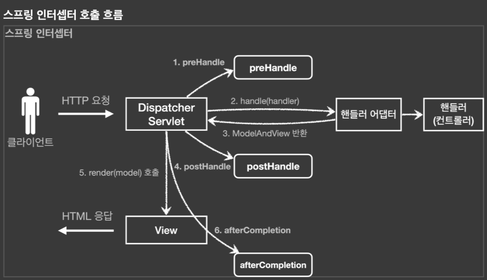
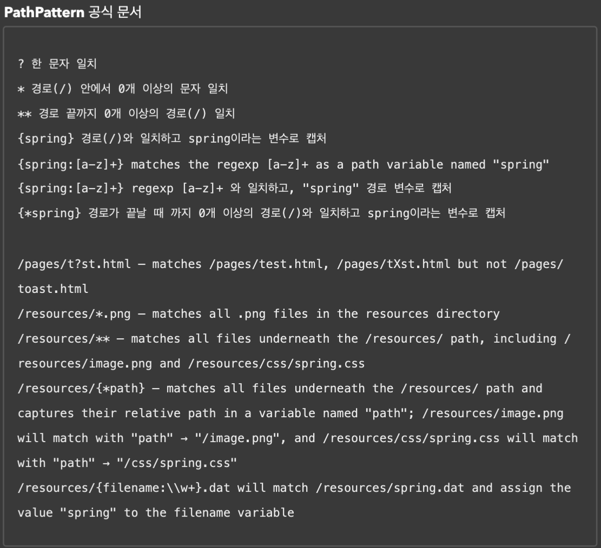

- `preHandler` : 컨트롤러 호출 전에 호출
  - `false`일 경우 나머지 인터셉터와 핸들러 어댑터도 호출하지 않고 종료된다.
- `postHandler` : 컨트롤러 호출 후에 호출
- `afterCompletion` : 뷰가 렌더링 된 이후에 호출
  - 앞단계인 `postHandler`에서 예외가 나도 `afterCompletion`은 호출된다.
- `Filter`와 `Interceptor`가 고민되면, 가급적 `Interceptor`를 사용한다.

