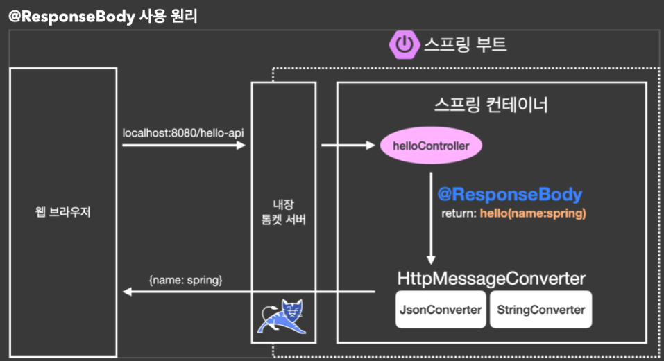
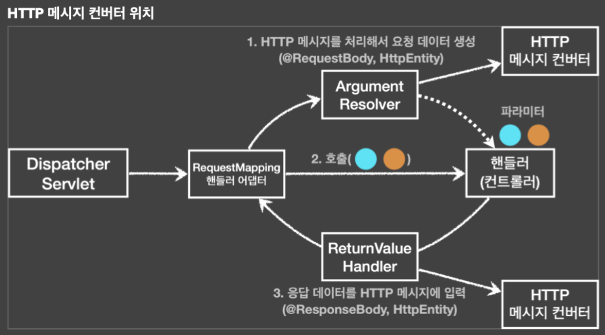
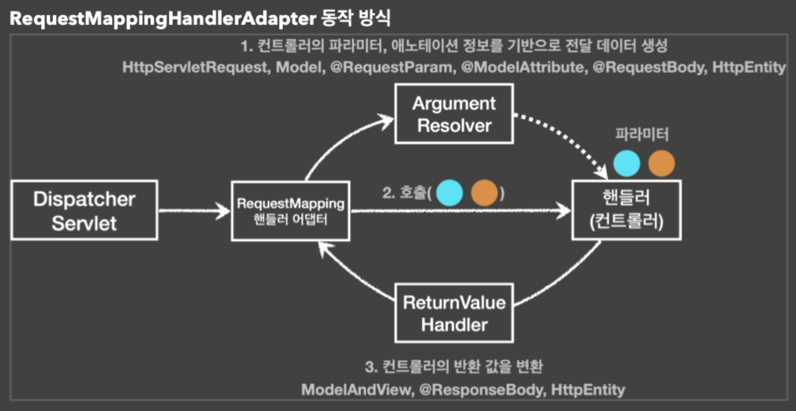

## HTTP 메시지 컨버터

- `@ResponseBody`는 `viewResolver` 대신에 `HttpMessageConverter`가 동작한다.
  - 기본 문자 처리 : `StringHttpMessageConverter`
  - 기본 객체 처리 : `MappingJackson2HttpMessageConverter`
- 응답은 클라이언트의 HTTP Accept 헤더와 서버의 컨트롤러 반환 타입 정보를 조합하여 선택한다.
- Spring은 아래와 같은 경우 HTTP 메시지 컨버터를 적용한다.
  - HTTP 요청 : `@RequestBody`, `HttpEntity(RequestEntity)`
  - HTTP 응답 : `@ResponseBody`, `HttpEntity(ResponseEntity)`
- Spring은
  - `@RequestBody`, `@ResponseBody`의 경우 `RequestResponseBodyMethodProcessor(ArgumentResolver)`를 사용한다.
  - `HttpMethod`가 있으면 `HttpEntityMethodProcessor(ArgumentResolver)`를 사용한다.

## 기본 메시지 컨버터(우선순위 순서대로)
- `canRead` / `canWrite` 로 결정한다.
1. `ByteArrayHttpMessageConverter`
   - `byte[]`를 처리
2. `StringHttpMessageConverter`
   - `String` 문자로 데이터를 처리
3. `MappingJackson2HttpMessageConverter`
   - `HashMap` 또는 `application/json`

## 요청 매핑 핸들러 어댑터 구조

### ArgumentResolver
- Spring이 다양한 파라미터를 처리할 수 있는건, `ArgumentResolver(HandlerMethodArgumentResolver)` 덕분이다.
- `RequestMappingHandlerAdapter`는 `ArgumentResolver`를 호출해서 핸들러가 필요로 하는 다양한 파라미터의 값(객체)을 생성한다.
- 그리고 파라미터 값이 모두 준비되면 컨트롤러를 호출하면서 값을 넘겨준다.
- `ArgumentResolver` 동작 방식
  - `supportParameter()`를 호출해서 해당 파라미터를 지원하는지 체크한다.
  - 지원하면 `resolveArgument()`를 호출하여 실제 객체를 생성한다.

### ReturnValueHandler
- `HandlerMethodReturnValueHandler`는 응답값을 변환하고 처리한다.
