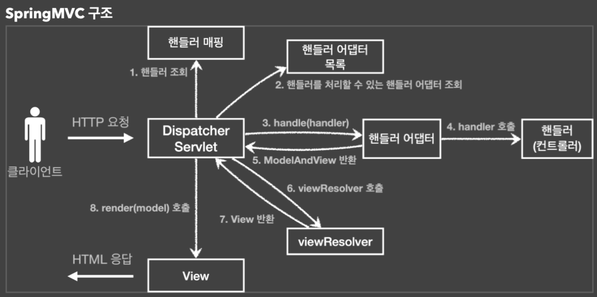

## MVC 구조



- `DispatcherServlet`은 `HttpServlet`을 상속받는다.
- 스프링 부트는 `DispatcherServlet`을 등록하면서 모든 경로에 대해 매핑한다.
- 서블릿이 호출되면, 결국 `DispatcherServlet`의 `doDispatch()`가 호출된다.
  - 핸들러 조회 : 핸들러 매핑을 통해 요청 URL에 매핑된 핸들러를 조회한다.
  - 핸들러 어댑터 조회 : 핸들러를 실행할 수 있는 핸들러 어댑터를 조회한다.
  - 핸들러 어댑터 실행 : 핸들러 어댑터를 실행한다.
  - 핸들러 실행 : 핸들러 어댑터가 실제 핸들러를 실행한다.
  - ModelAndView 반환 : 핸들러 어댑터는 핸들러가 반환하는 정보를 ModelAndView로 변환해서 반환한다.
  - 뷰 리졸버 호출 : 뷰 리졸버를 찾고 실행한다.
  - 뷰를 찾아 반환 : 렌더링 역할을 담당하는 뷰 객체를 반환
  - 뷰 랜더링 : 뷰를 통해 뷰를 렌더링

## 핸들러 매핑과 핸들러 어댑터
- `HandlerMapping` 순위
  1. RequestMappingHandlerMapping : `@RequestMapping`에 사용
  2. BeanNameUrlHandlerMapping : 스프링 빈의 이름으로 핸들러 찾음
- `HandlerAdapter` 순위
  1. RequestMappingHandlerAdapter : `@RequestMapping`에 사용
  2. HttpRequestHandlerAdapter : `HttpRequestHandler` 처리
  3. SimpleControllerHandlerAdapter : `Controller` 인터페이스에 사용
- `ViewResolver` 순위
  1. BeanNameViewResolver : 빈 이름으로 뷰를 찾아 반환
  2. InternalResourceViewResolver : JSP를 처리할 수 있는 뷰 반환

- `Controller` 인터페이스를 사용하는 방법
  - `BeanNameUrlHandlerMapping`이 핸들러를 찾는다.
  - `SimpleControllerHandlerAdapter`이 어댑터 역할을 한다.
  - `InternalResourceViewResolver` 사용
```java
@Component("/springmvc/old-controller")
public class OldController implements Controller {
    
    @Override
    public ModelAndView handleRequest(HttpServletRequest request, HttpServletResponse response) throws Exception {
        return new ModelAndView("new-form");
    }
}
```

- `HttpRequestHandler`를 이용하는 방법
  - `BeanNameUrlHandlerMapping` 사용
  - `HttpRequestHandlerAdapter` 어댑터 사용
```java
@Component("/springmvc/request-handler")
public class MyHttpRequestHandler implements HttpRequestHandler {
    @Override
    public void handleRequest(HttpServletRequest request, HttpServletResponse response) throws ServletException, IOException {
        ...
    }
}
```

- `RequestMapping`을 이용하는 방법
  - `RequestMappingHandlerMapping` 사용
    - 스프링 빈 중에서 `@RequestMapping` 또는 `@Controller`가 클래스 레벨에 붙어 있는 경우에 매핑 정보로 인식
  - `RequestMappingHandlerAdatper` 사용
```java
@Controller
@RequestMapping("/springmvc/v1/members")
public class SpringMemberFormControllerV1 {

    @RequestMapping("/new-form")
    public ModelAndView process() {
        Member member = new Member();
        ModelAndView mv = new ModelAndView("new-form");
        mv.addObject("member", member);

        return mv;
    }

    @GetMapping
    public String member(@RequestParam("username") String username, Model model) {
        // @RequestParam로 HTTP 요청 파라미터를 받을 수 있다.
        // request.getParameter("username")과 유사하다.
        Member member = memberRepository.find(username);
        model.addAttribute("member", member);
        return "member";
    }
}
```

### 참고
- Bean을 등록할 때, 컴포넌트 스캔을 통해 먼저 빈 등록을 진행 한 후 `@Configuration`에 있는 빈을 등록한다.
